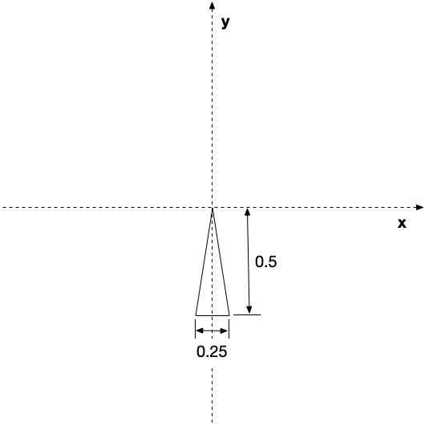

**Written Questions Due Thursday, Sept 10th by 12:30/2:00 PM** (in class)

**Program Due: Monday, Sept 14th by 11:59 PM** Late assignments will be penalized 20 points per day.

## Getting Started

Download [CS370\_Assign01.zip](src/CS370_Assign01.zip), saving it into the **assignment** directory.

Double-click on **CS370\_Assign01.zip** and extract the contents of the archive into a subdirectory called **CS370\_Assign01**

Open CLion, select **Open or Import** from the main screen (you may need to close any open projects), and navigate to the **CS370\_Assign01** directory. This should open the project and execute the [CMake](https://cmake.org) script to configure the toolchain.

## Written Questions

1.  What are the main advantages and main disadvantages to generating images using the graphics pipeline?
2.  Show that a rotation and a *uniform* scaling transformations (i.e. one where all the scale factors are identical) are commutative, i.e. that they can be applied in either order. 

	> Hint: Given the *general* 4x4 matrices for each transformation
	>
    > 
	>
	> show that the appropriate matrix products commute, i.e. give the same result for *both* orderings.
	
3. Given the following set of vertices that define a square

> 

-   Sketch a set of *intermediate* transformations to produce the following end result with proper size, orientation, and location. Give the final product of your particular transformation sequence using **T(dx,dy)** for a translation by *dx* and *dy*, **R(θ)** for a rotation (about the *z* axis) by angle θ, and **S(sx,sy)** for a scaling by *sx* and *sy*.

> 

-   Sketch a set of *intermediate* transformations using only the *upper left* triangle vertices to produce the following end result with proper size, orientation, and location. Give the final product of your particular transformation sequence using **T(dx,dy)** for a translation by *dx* and *dy*, **R(θ)** for a rotation (about the *z* axis) by angle θ, and **S(sx,sy)** for a scaling by *sx* and *sy*.

> 
	
## Programming assignment

Write a program that draws a simple 2D "windmill" scene using OpenGL. The scene should include:

-   A shaded blue sky from top to bottom
-   A shaded green lawn from bottom to top
-   A windmill with brown walls and red roof
-   A fan with three blades (which can just use the sky color).
-   A shaded yellow sun from center to edge
-   \<space\> should start/stop the windmill fan spinning using *time based* animation
-   left mouse button should reverse the fan direction
-   \<esc\> should quit the program

*Hints:*

> OpenGL renders scenes using a *Painter's Algorithm* (at least for now). In this type of algorithm, the object that is rendered *last* will appear on *top*. This can be useful for making complicated shapes by simply overlapping simple shapes rather than using a single polygon with many vertices.
>
> All the *square* and *triangle* shapes should be generated with the **provided** set of vertices. Use indexing to create the geometry from the vertices. Since the *square* is made from two *triangle*s, you can draw a triangle by just using the first few indices when rendering.
>
> Define separate color buffers for the different colors needed, e.g. gradient blue for the sky, gradient green for the grass, solid brown for the house, etc. Consider which colors should be assigned to which vertices to achieve the desired effect.
>
> Use **transformations** to create all the geometry from the *square* (*triangle*) vertices. It may be helpful to sketch the scene on a sheet of graph paper to determine proper scale factors, rotation angles, and translation offsets. **Note:** Scalings and rotations are defined relative to the world coordinate *origin* **not** the object *center*.
>
> For the sun, **GL\_TRIANGLE** is *not* the only type of object that can be rendered in OpenGL. Chap 3 of *OpenGL: Programming Guide* discusses several other primitive types that can be used to render a set of vertices.
>
> Use *global variables* to avoid *magic numbers* in the code, particularly for object transformations.
>
> Don't forget to *register* your callbacks, otherwise user interaction will have no effect.

Grading Criteria
================

**The program MUST compile to receive any credit** (so develop incrementally).

-   Create indexed square - 5 points
-   Create color buffers - 10 points
-   Draw shaded sky: 15 points
-   Draw shaded grass: 15 points
-   Draw solid house: 10 points
-   Draw fan: 15 points
-   Draw shaded sun: 10 points
-   Animation (keyboard, idle callbacks): 10 points
-   Creativity: 10 points

*Be creative!* For example, have the \<space\> act like a "puff" of air that starts the fan spinning but then gradually slows down until another \<space\> is pressed. Another option would be to add a keypress that changes the scene from day to night with the sun changing to a moon.

## Compiling and running the program

You should be able to build and run the program by clicking the small green arrow towards the right of the top toolbar.

> 

To quit the program simply close the window.

Submitting to Marmoset
======================

At the top right of the CLion window, expand the drop down menu to change the configuration to **MAKE\_ZIP** and click the green arrow

> 

You may see a configuration dialog, simply click the **Run** button and **Continue Anyway** in the Change Configuration Settings popup dialog. This should generate a **solution.zip** file in the project root directory. Log into [Marmoset](https://cs.ycp.edu/marmoset/login) and manually upload the **solution.zip** file to the **assign01** submission.

**You are responsible for making sure that your submission contains the correct file(s).**

