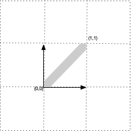
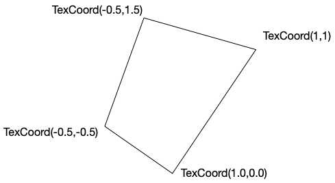
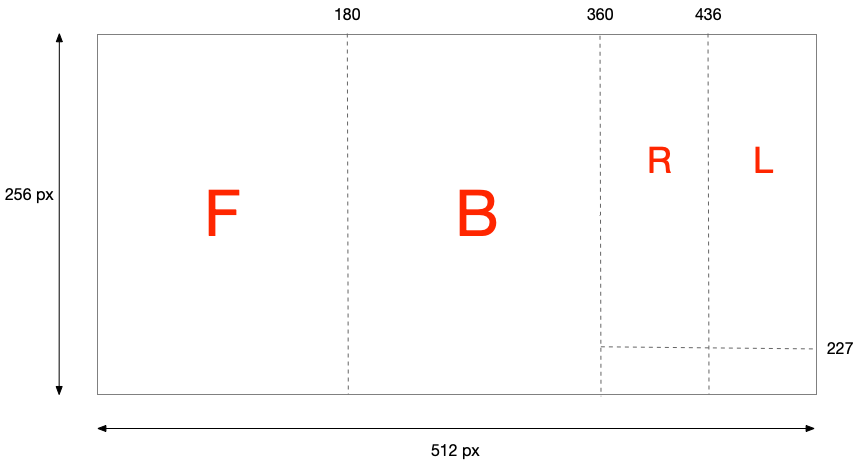
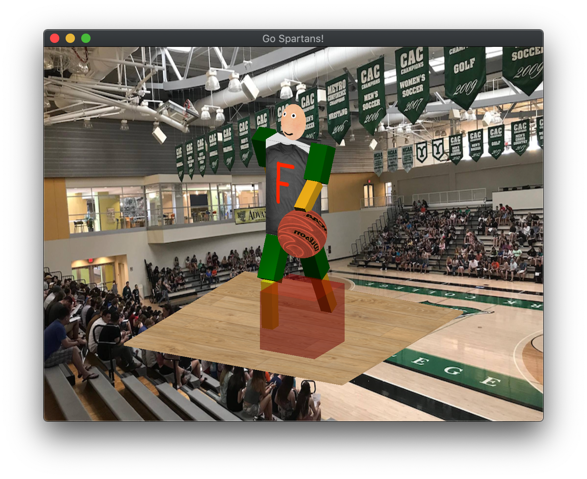

**Written Questions Due: Thurs, Nov 12th by 12:30/2:00 PM** (in class)

**Program Due:**

**Milestone 1: Tuesday, Nov 3rd by 11:59 PM** 

**Milestone 2: Monday, Nov 16th by 11:59 PM** Late assignments will be penalized 20 points per day.

## Getting Started

Download [CS370\_Assign04.zip](src/CS370_Assign04.zip), saving it into the **assignment** directory.

Double-click on **CS370\_Assign04.zip** and extract the contents of the archive into a subdirectory called **CS370\_Assign04**

Open CLion, select **Open or Import** from the main screen (you may need to close any open projects), and navigate to the **CS370\_Assign04** directory. This should open the project and execute the [CMake](https://cmake.org) script to configure the toolchain.

## Written Questions

1.  Using the example robot from [lab 14](../labs/lab14.html) suppose we know the *position* where one of the upper arms is starting and have a specific final *location* we want the arm to have. Give a method to create the path the robot should follow to get from the starting point to the end point.

2.  Using the example scene graph diagram from [lab 14](../labs/lab14.html), sketch the scene graph for the programming portion of the assignment. **Note:** You only need to show the relationships between the nodes, i.e. it is not necessary to include transformations.

3.  Given the following texture map

    > 
    >
    > with wrapping modes
    >
    >     glTexParameteri(GL_TEXTURE_2D, GL_TEXTURE_WRAP_S, GL_CLAMP);
    >     glTexParameteri(GL_TEXTURE_2D, GL_TEXTURE_WRAP_T, GL_REPEAT);
    >
    > sketch the surrounding parts of the texture plane.

4.   Using the texture plane from question 3, sketch the textured figure given below using the provided texture coordinates

> 

### Hints

> 1.  This problem is known as *reverse kinematics* and is a key area of robotics research. Representing the individual transformations symbolically as **T**(*dx*, *dy*, *dz*), **R**(*ang*), and **S**(*sx*, *sy*, *sz*), first determine the *net* transformation matrix for the upper arm in terms of the base angle θ, lower arm angle φ, and upper arm angle ψ along with any translations for each part. Then let the initial base and joint angles be θi, φi, ψi and final base and joint angles be θf, φf, ψf. These angles would be found by *solving* the transformation matrix equations for the angles (which you may assume can be done to compute all these angles). Using these sets of angles describing the location of the two points, suggest an interpolation scheme to *smoothly* transition from one to the other.
> 2.  Consider which nodes are relative to other nodes (*children*) and which ones are independent (*siblings*). 
> 3.  Note that the texture plane actually extends infinitely in both directions.
> 4.  Mark the texture coordinates on the texture plane, then "cut" this section out and "stretch" it to fit on the object. 

### Programming assignment

Write a program that draws a 3D scene of a walking player with articulated arms and legs along with a bouncing basketball into a translucent box sitting on a court. A sample executable is included in the skeleton zip file as **WalkingManSolWin.exe**, **WalkingManSolMac**, or **WalkingManSolLinux** (the Mac and Linux versions should be run from the command line). Keyboard controls are provided that allow an orthographic camera to be rotated using WASD. The scene should include:

-   A background image of your choosing (or you may use the included **ycp.png** file). **Note:** You will need to add texture coordinates for each vertex of the background quad using **.push_back()** for the *uvCoords* vector in **build\_geometry()**.
-   A *scene graph* to render the player, basketball, court, and box. Create materials to enhance the scene appearance.
-   The player should consist of

    > -   Rectangular torso with a shirt
    > -   Elliptical head with a face
    > -   Rectangular arms and legs with two segments that have lighting with different materials

-   Scale factors for all the player parts are included in **player.h**.
-   All the parts of the player other than the torso and head should use materials and lighting.
-   The torso of the player should use the *TexCube* object (**not** the *Cube* object) which will be texture mapped using the **shirt\_z.png** texture. You will need to add texture coordinates for each face in the *uvCoords* vector in **build\_geometry()**. Note that the texture map contains labelled pieces for the front, back, left, and right faces of the cube (you may use any parts of the texture map for the top/bottom faces). The pixel locations for the divisions between the segments is shown below:

    > 

-   The box should be translucent such that the basketball can be seen inside it and the court/player can be seen through it.
-   The player should "walk" by moving arms in opposition to the legs. The steps should be time-based, i.e. should occur at a rate of *sps* (steps-per-second).
-   The player should "dribble" the basketball in sync with the steps as well as rotate forward.
-   \<spacebar\> should toggle the animations
-   Use the part dimensions given in the file **player.h** - **NO MAGIC NUMBERS**.
-   \<esc\> should quit the program.

### Hints

> - When creating the node, the base transform should simply scale and locate the object in a convenient place. Then the update transform should position it relative to its parent and apply any dynamic transformations.
>
> - Start with the torso on the *x-z* plane and position the other nodes accordingly.
>
> - Consider the necessary rendering order for the objects in the scene graph in order for transparency to work properly.
>
> - Loading the included models will create position, normal, and texture coordinate buffers, thus they can be used for any type of node. Consider which elements of the scene should use **MatNode**s and which should use **TexNode**s.
>
> - Be sure to enable alpha blending and set appropriate blend factors for alpha blending effects. You will need to create "translucent" materials with non-unity alpha values and render translucent objects in the proper order within the scene graph.
>
> - You can use the provided lighting and texture shaders as well as the light sources.

## Grading Criteria

**The program MUST compile to receive any credit** (so develop incrementally).

**Milestone 1** - 32 points

-   Initialization (main): 5 points
-   Background image: 5 points
-   Player torso node (arbitrary texture coordinates): 5 points
-   Player head node (with texture map): 5 points
-   Player left upper arm node: 5 points
-   Player right upper arm node: 5 points
-   Upper limb material: 2 points

**Milestone 2** - 68 points

-   Remaining player limb nodes: 20 points
-   Lower limb material: 2 points
-   Basketball node (with texture map): 5 points
-   Court node (with texture map): 5 points
-   Box node: 4 points
-   Translucent material: 2 points
-   Proper torso texture coordinates: 10 points
-   Robot animation: 10 points
-   Basketball animation: 5 points
-   Creativity: 5 points

*Be creative!* For example, enhance the geometry of the scene and/or use additional animations. Remember that the program should still have reasonable performance on the lab machines.

## Compiling and running the program

You should be able to build and run the program by clicking the small green arrow towards the right of the top toolbar.

> 

To quit the program simply close the window.

## Submitting to Marmoset

At the top right of the CLion window, expand the drop down menu to change the configuration to **MAKE\_ZIP** and click the green arrow

> 

You may see a configuration dialog, simply click the **Run** button and **Continue Anyway** in the Change Configuration Settings popup dialog. This should generate a **solution.zip** file in the project root directory. Log into [Marmoset](https://cs.ycp.edu/marmoset/login) and manually upload the **solution.zip** file to the **assign04\_ms1** or **assign04\_ms2** submission.

**You are responsible for making sure that your submission contains the correct file(s).**
