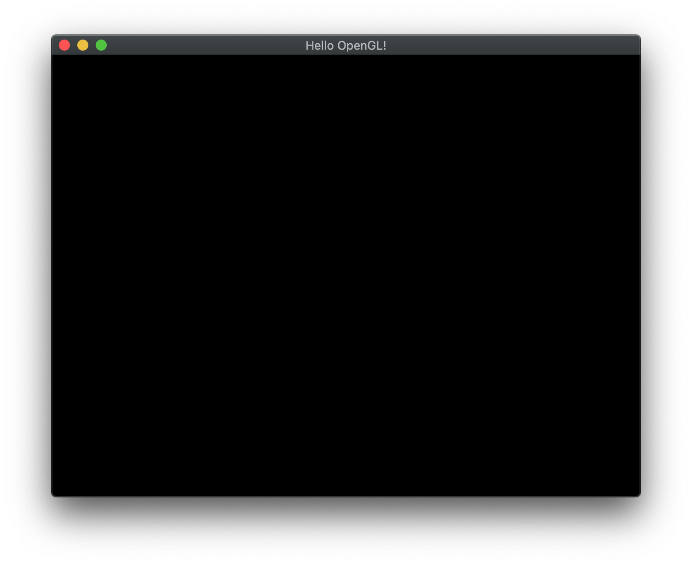
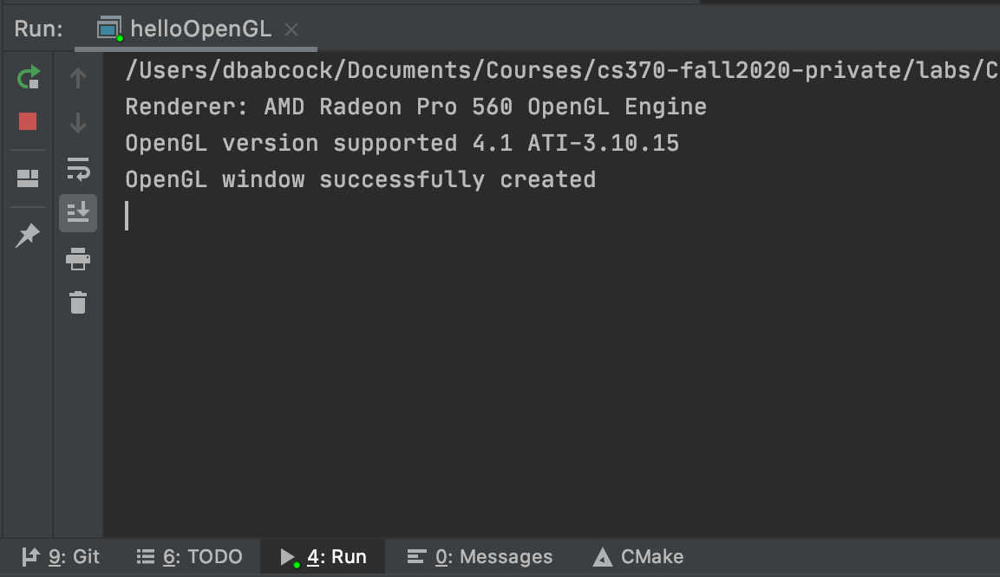

OpenGL programs are usually written in C although there have been wrappers written to encapsulate OpenGL functionality in Java and C\#. In any case, to write OpenGL programs we must be able to interact with the underlying graphics system which is system/OS dependent. In particular, *displaying* output requires manipulation of the operating system's *window manager*. To *greatly* simplify this process, we will be using [GLFW](https://www.glfw.org) (an open source library) which is available for all platforms and will abstract the system specific window management details for us. GLFW will also provide for basic user interaction via handling keyboard and mouse events (and even joysticks). We will also be using the [GLEW](http://glew.sourceforge.net) extension library to expose OpenGL extension support for systems such as Windows.

For this course, we will be targeting OpenGL 4.1, which is the latest version of OpenGL supported by Mac/OSX, thus this lab will ensure that the system supports at least this version.

To eliminate the need for installation of GLFW and GLEW, all the labs will include directories with the necessary headers and libraries. As we proceed through the course, we will be adding additional libraries that will allow us to load in models, load in images, and generate tangent spaces.

We will be using [CMake](https://cmake.org) to configure our build environment for proper compilation across different platforms.

## Getting Started

Create a directory on your **H:** drive named **CS370** (or anywhere else you choose). Navigate into this new directory and create a subdirectory named **labs**.

Download [CS370\_Lab00.zip](CS370_Lab00.zip), saving it into the **labs** directory.

Double-click on **CS370\_Lab00.zip** and extract the contents of the archive into a subdirectory called **CS370\_Lab00**

Open CLion, select **Open or Import** from the main screen (you may need to close any open projects), and navigate to the **CS370\_Lab00** directory. This should open the project and execute the CMake script to configure the toolchain.

## Creating an OpenGL Window with GLFW

At the beginning of the **main** function you should see:

```cpp
	// Create OpenGL window
	GLFWwindow* window = CreateWindow("Hello OpenGL!");
    if (!window) {
        fprintf(stderr, "ERROR: could not open window with GLFW3\n");
        glfwTerminate();
        return 1;
    } else {
        printf("OpenGL window successfully created\n");
    }
```

This code calls a function in the **utils.cpp** file that uses GLFW to create an OpenGL window and display the supported version of OpenGL for the system hardware. **Note:** For this class we will want at least OpenGL 4.1 support.

## Run Display Loop

To begin rendering, we will use the following code:

```cpp
    // Start loop
    while ( !glfwWindowShouldClose( window ) ) {
        // Retrieve any UI events
        glfwPollEvents();
    }

    // Close window
    glfwTerminate();
```

This loop will eventually redraw the window repeatedly (using double buffering) and polls the OS for any UI events. Once the system receives notification that the user wishes to terminate the program, we will call a GLFW cleanup routine to release any allocated system resources.

## Compiling and running the program

You should be able to build and run the program by clicking the small green arrow towards the right of the top toolbar.

At this point you should see a blank window with the title **Hello OpenGL!** and output in the CLion console window listing the supported OpenGL version.

> 

> 

To quit the program simply close the window.

Congratulations, if this program runs you are all set to start creating your own 3D graphics! Let the fun begin!

