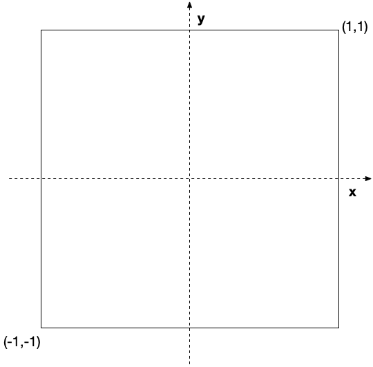
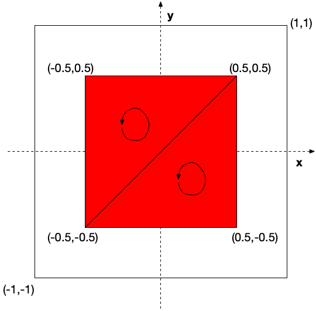

All graphics API's, including OpenGL, utilize standard hardware on all graphics cards known as the *graphics pipeline*. The version of the graphics chip (GPU) will determine which version of the API is supported in hardware, and in conjunction with the graphics driver, what functionality the programmer has access to. We can manipulate the functionality of the different stages of the pipeline using *shaders* which we will discuss in subsequent labs.

Regardless of the API, all graphics hardware works by taking a set of (3D) *vertices* that define the *geometry* of the objects from the application and then performing the necessary mathematical operations to ultimately convert the objects onto *pixels* on a (2D) screen. In this lab we will see how to transfer vertex coordinates from the application to the graphics card.

## Getting Started

Navigate into the **CS370\labs** directory on your **H:** drive.

Download [CS370\_Lab01.zip](src/CS370_Lab01.zip), saving it into the **labs** directory.

Double-click on **CS370\_Lab01.zip** and extract the contents of the archive into a subdirectory called **CS370\_Lab01**

Open CLion, select **Open or Import** from the main screen (you may need to close any open projects), and navigate to the **CS370\_Lab01** directory. This should open the project and execute the [CMake](https://cmake.org) script to configure the toolchain.

## Defining Geometry

Each vertex is represented by three *coordinates* **x**, **y**, and **z**. (In this lab we will only define **x** and **y** vertex coordinates, thus the graphics system will simply assign **z**=0.) We can then think of the geometry for an object as a two dimensional array consisting of the number of vertices by the number of coordinates. 

Coordinates are defined within a *world-coordinate system* which defaults to the origin (0,0) at the center of the screen, (1,1) the upper-right corner, and (-1,-1) the lower left corner as shown in the following figure:

> 

Any vertices with coordinates outside these extents is *clipped* from the final rendered image. Later we will learn how to set the world-coordinate extents to values of our choosing.

Furthermore, we will be drawing our objects using **triangles** as triangles have three distinct properties that make them useful primitives:

1. Triangles are **simple** since the edges *only* intersect at vertices, thus a triangle will have a well defined *interior*.
2. Triangles are **convex** since any line drawn between two points in/on the triangle is also completely in/on the triangle, thus a triangle will only generate one convex shape if it is clipped by the boundary of the viewing area.
3. Triangles are **flat** since any three non-colinear points determine a plane, thus a triangle will have a unique **normal**, i.e. vector perpendicular to the plane, which we will use when we add lighting to our scenes. The direction of the normal is determined using the *right-hand rule* where we curl our fingers of our *right hand* following the ordering of the vertices and our *thumb* will point in the direction of the *positive normal*. The positive normal will indicate the **front face** of the triangle. Eventually when we combine triangles into more complicated shapes, we need to ensure that all the normals are pointing *outward* for proper rendering and shading.

Hence, to draw a square we will divide it up into *two* triangles oriented as shown in the following figure:

> 

Once we have created this array, we will load the data into a *buffer* for the graphics pipeline to use later when we wish to render the object.

**Creating Vertex Arrays**

First we need to create OpenGL vertex array objects which describe how the data is stored in the buffers. This is done in a two step process.

*Generation*

First we need to generate *names* for the array object (similar to references) using

```cpp
void glGenVertexArrays(GLsizei n, GLuint *arrays);
```

where *n* is the number of arrays to create, and \**arrays* is an array to store the names in.

*Binding* 

After we have generated the names, we need to bind these *names* to the actual objects. Binding an object will make it active such that subsequent operations will utilize that object, and allocate memory if it is the first time the object is bound. Binding a vertex array is done using

```cpp
void glBindVertexArray(GLuint array);
```
 
where *array* is typically one of the references from the above generation step.

**Creating Vertex Buffers**

Creating vertex buffers which will store the actual data follows a similar two step process as creating vertex arrays.

*Generation*

We again first generate a set of *names* for the buffer objects using

```cpp
void glGenBuffers(GLsizei n, GLuint *buffers);
```

where *n* is the number of buffers to create, and \**buffers* is an array to store the names in.

*Binding* 

After we have generated the names, we need to bind these *names* to the actual objects. Binding an object will make it active such that subsequent operations will utilize that object, and allocate memory if it is the first time the object is bound. Binding a vertex buffer is done using

```cpp
void glBindBuffer(GLenum target, GLuint buffer);
```
 
where *target* is the type of buffer, in this case we'll specify **GL\_ARRAY\_BUFFER** to indicate this is a vertex array buffer, and *buffer* is typically one of the references from the above generation step.

**Loading Vertex Data**

Once we have created our buffers and have bound the one we wish to load data into, we place data in the buffer using

```cpp
void glBufferData(GLenum target, GLsizeiptr size, const GLvoid *data, GLenum usage);
```

where *target* is again the type of buffer (again in this case **GL\_ARRAY\_BUFFER**), *size* is the size of the data (in bytes) we wish to store typically found using the C **sizeof()** function on our data source, \**data* is the data source itself, and *usage* is a hint regarding how the data will be used which for now we will use **GL\_STATIC\_DRAW** since this is geometry we will not be changing throughout the life of the program.
 
### Tasks

- Add code to **build\_geometry()** to generate *NumVAOs* vertex array names storing them in the *VAOs* array. **Note:** These variables are declared *globally* and will provide a convenient way of modifying our program when we wish to use multiple objects, e.g. the *VAO\_IDs* enum will provide symbolic constants for the indices of the *VAOs* array with the last element (*NumVAOs*) being the number of elements in the *VAOs* array.

- Add code to **build\_geometry()** to bind the *first* element (*Triangles*) from the **VAOs** array. **Hint:** The *VAO\_IDs* enum will contain a list of symbolic constants indexing the *VAOs* array.

- Add code to **build\_geometry()** create an array of 2D vertices of type *GLfloat* (refer to the red square figure above to see why there are 6 vertices in the order specified)

```cpp
	GLfloat vertices[][2] = {
		{-0.5f,-0.5f},
		{ 0.5f, 0.5f},
		{-0.5f, 0.5f},
		{-0.5f,-0.5f},
		{ 0.5f,-0.5f},
		{ 0.5f, 0.5f}
	};
```
 
- Add code to **build\_geometry()** to generate *NumBuffers* buffer names storing them in the *Buffers* array. **Note:** These variables are declared *globally* and will provide a convenient way of modifying our program when we wish to use multiple objects, e.g. the *Buffer\_IDs* enum will provide symbolic constants for the indices of the *Buffers* array with the last element (*NumBuffers*) being the number of elements in the *Buffers* array.

- Add code to **build\_geometry()** to bind the *first* element (*PosBuffer*) from the *Buffers* array. **Hint:** The *Buffer\_IDs* enum will contain a list of symbolic constants indexing the *Buffers* array.

- Add code to **build\_geometry()** to load data from the *vertices* array into the currently bound buffer. **Hint:** To get the size of the *vertices* array use the **sizeof()** function, and set the usage flag to **GL\_STATIC\_DRAW**.

## Rendering Geometry

After we build our geometry buffers, we need to create a *shader* program which will tell the pipeline what to do with the data in the buffer. We will defer discussion of this process as well as writing shader code for subsequent labs.

After we have loaded our shaders, we will perform all our rendering in the **display()** function. This function is called from within the graphics loop in **main()**. Our graphics system will use *double buffering* where our drawing will occur in the *back buffer* and then once all the rendering has completed we will *swap* it to become the *front buffer* displayed on the screen. This type of rendering avoids tearing effects by ensuring we have completed updating the framebuffer *before* placing it on the screen.

Thus our rendering loop will become

```cpp
    // Start loop
    while ( !glfwWindowShouldClose( window ) ) {
        // Draw graphics
        display();
        // Update other events like input handling
        glfwPollEvents();
        // Swap buffer onto screen
        glfwSwapBuffers( window );
    }
```

**display() Function**

For now, we will simply use the **display()** function to clear the framebuffer using

```cpp
    glClear(GL_COLOR_BUFFER_BIT);
```

to give us a blank slate to draw on. **Note:** A *background* (or clear) *color* can be set using **glClearColor()** in **main()** before starting the graphics loop. Then we will call the **render\_scene()** function which will draw all of our objects in *world coordinates*. And finally we will call

```cpp
    glFlush();
```

to ensure that the pipeline has completed rendering all the geometry prior to swapping the framebuffers.

**render\_scene() Function**

Finally we are ready to draw our objects.

First we will select the shader program we wish to use to render the object using

```cpp
void glUseProgram(GLuint program);
```

where *program* is a reference to our desired shader program.

Next, we bind the vertex array for the object we are going to draw again using 

```cpp
void glBindVertexArray(GLuint array);
```
 
where *array* is the reference to our object's vertex array.

Then we will associate our vertex array with the corresponding shader variable (discussed in a subsequent lecture) using 

```cpp
void glVertexAttribPointer(GLuint index, GLint size, GLenum type, GLboolean normalized, GLsizei stride, const GLvoid *pointer);
```

where *index* is a reference to the corresponding shader variable location, *size* is the number of coordinates in the vertex, *type* is the datatype for the coordinates, *normalized* indicates whether to normalize the coordinates in the range [-1,1], *stride* is the offset between consecutive vertices in the buffer, and finally \**pointer* is the offset of the starting location for the data (despite its awkward signature).

Then we will enable these attributes using

```cpp
void glEnableVertexAttribArray(GLuint index);
```

where *index* is the reference to the corresponding shader variable location.

Lastly, we will then bind our vertex buffer again using

```cpp
void glBindBuffer(GLenum target, GLuint buffer);
```
 
where *target* will be **GL\_ARRAY\_BUFFER** since this is a vertex array buffer, and *buffer* will be a reference to our buffer object.

After all the buffers are set up, we finally can directly draw using the data buffer using

```cpp
void glDrawArrays(GLenum mode, GLint first, GLsizei count);
```

where *mode* is the type of primitives we want to use with the vertices (e.g. **GL\_TRIANGLES**, *first* is the offset of the starting vertex to use for the object, and *count* is the number of vertices to use for the current object. Hence it is possible to store multiple objects in the same vertex array and draw them by specifying different offsets and counts.

### Tasks

- Add code to **display()** to clear the framebuffer

- Add code to **display()** to call **render\_scene()**

- Add code to **display()** to ensure all the rendering has completed

- Add code to **render\_scene()** to select the *program* shader program

- Add code to **render\_scene()** to bind the *Triangles* vertex array from the *VAOs* name array created earlier

- Add code to **render\_scene()** to bind the *PosBuffer* element from the *Buffers* array

- Add code to **render\_scene()** to associate the shader variable location stored in *vPos*, with *posCoords* coordinates per vertex (which is set to 2), that are of type **GL\_FLOAT**, without normalization, no stride (since the data is tightly packed), and no offset using

```cpp
    glVertexAttribPointer(vPos, posCoords, GL_FLOAT, GL_FALSE, 0, NULL);
```

- Add code to **render\_scene()** to enable the attributes using the shader location *vPos* using

```cpp
    glEnableVertexAttribArray(vPos);
```

- Add code to **render\_scene()** to draw the geometry using **GL\_TRIANGLES** starting at vertex 0 and using *numVertices* vertices

**Note:** For this lab, we are not specifying the *color* of our object in the application, but rather setting it directly in the fragment shader

## Compiling and running the program

You should be able to build and run the program by clicking the small green arrow towards the right of the top toolbar.

At this point you should see a red square.

> 

To quit the program simply close the window.

Congratulations, you have now rendered your first geometry. Typically we will not want to manually create geometry, so later we will see how to load in geometry generated by modeling programs such as [Blender](https://www.blender.org).

Next we will learn how to create objects using *indexed* geometry to avoid repeating duplicate vertices to minimize the size of the vertex buffers.
