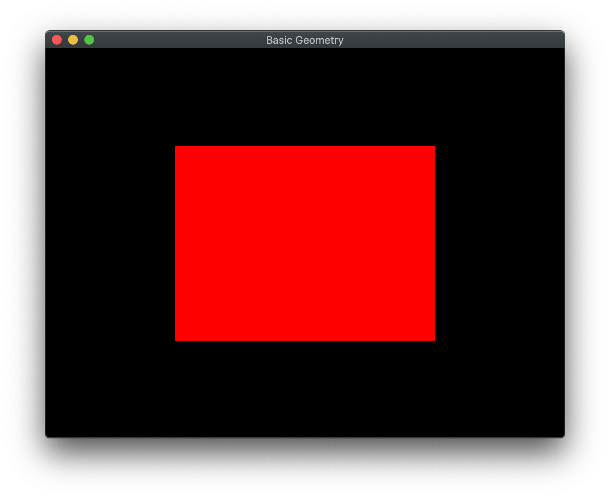

OpenGL programs are usually written in C although there have been wrappers written to encapsulate OpenGL functionality in Java and C\#. In any case, to write OpenGL programs we must be able to interact with the underlying graphics system. In particular, *displaying* output requires manipulation of the operating system's window manager. To *greatly* simplify this process, we will be using [GLFW](https://www.glfw.org) (an open source library) which is available for all platforms. Through some simple initialization, this package will take care of all the window management as well as provide for basic user interaction via handling keyboard and mouse events (and even joysticks).

## Getting Started

Create a directory on your **H:** drive named **CS370** (or anywhere else you choose). Navigate into this new directory and create a subdirectory named **labs**.

Download [CS370\_Lab01.zip](CS370_Lab01.zip), saving it into the **labs** directory.

Double-click on **CS370\_Lab01.zip** and extract the contents of the archive into a subdirectory called **CS370\_Lab01**

Open CLion, select **Open or Import** from the main screen (you may need to close any open projects), and navigate to the **CS370\_Lab01** directory. This should open the project and execute the [CMake](https://cmake.org) script to configure the toolchain.

## Creating an OpenGL Window with GLFW

At the beginning of the **main** function you should see:

```cpp
	// Create OpenGL window
	GLFWwindow* window = CreateWindow("Hello OpenGL!");
    if (!window) {
        fprintf(stderr, "ERROR: could not open window with GLFW3\n");
        glfwTerminate();
        return 1;
    } else {
        printf("OpenGL window successfully created\n");
    }
```

This code calls a function in the **utils.cpp** file that uses GLFW to create an OpenGL window and display the supported version of OpenGL for the system hardware. **Note:** For this class we will want at least OpenGL 4.1 support.

## Create GLSL Shader Program

In order to have GLUT handle the window management tasks, typically **main()** will contain the following sections:

-   initialize the library
-   set the various window properties
-   create the window
-   register any needed callbacks
-   begin the (infinite) event loop

Add the following code to the source file:

```cpp
int main(int argc, char *argv[])
{
	// Initialize GLUT
	glutInit(&argc,argv);

	// Initialize the window with double buffering and RGB colors
	glutInitDisplayMode(GLUT_DOUBLE | GLUT_RGB);

	// Set the window size to 500x500 pixels
	glutInitWindowSize(500,500);

	// Create window
	glutCreateWindow("Hello OpenGL!");

	// Define callbacks
	glutDisplayFunc(display);

	// Begin event loop
	glutMainLoop();

	return 0;
}
```

This structure for **main()** will serve as a template for all the programs we will write in this course through modifying the window properties and registering additional callbacks.

3\. Draw in **display()**
=========================

The display callback is executed every time the window needs to be redrawn (similar to the *paint* method in C\#), including when the program first starts. Later we will see how to use this routine to perform animations and interactive scenes. We will begin by simply drawing a red square by clearing the screen, draw the scene (simply a red square), flushing the buffer, and swapping the buffer to display it on the screen (via double buffering). Don't worry about understanding the code at this point as we will be covering all these commands in more detail in subsequent classes.

Add the following code to the source file:

```cpp
// Display callback
void display()
{
	// Reset background
	glClear(GL_COLOR_BUFFER_BIT);

	// Render scene
	render_Scene();

	// Flush buffer
	glFlush();

	// Swap buffers
	glutSwapBuffers();
}

// Scene render function
void render_Scene()
{
	// Set current color to red
	glColor3f(1.0,0.0,0.0);

	// Draw square
	glBegin(GL_POLYGON);
		glVertex2f(-0.5,-0.5);
		glVertex2f(-0.5,0.5);
		glVertex2f(0.5,0.5);
		glVertex2f(0.5,-0.5);
	glEnd();
}
```

For the most part, *any drawing* should be done in the **render\_Scene()** function (or other helper functions called from within **render\_Scene()**).

Compiling and running the program
=================================

Once you have completed typing in the code, you can build and run the program in one of two ways:

> -   Click the small green arrow in the middle of the top toolbar
> -   Hit **F5** (or **Ctrl-F5**)

(On Linux/OSX: In a terminal window, navigate to the directory containing the source file and simply type **make**. To run the program type **./helloOpenGL.exe**)

At this point you should see a window with the title **Hello OpenGL!** that has a red square in it similar to below.

> 

To quit the program simply close the window.

Congratulations, you have just written your first OpenGL program! Now the fun begins.

