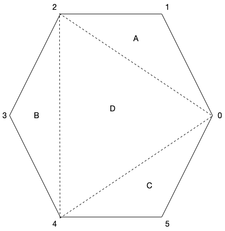
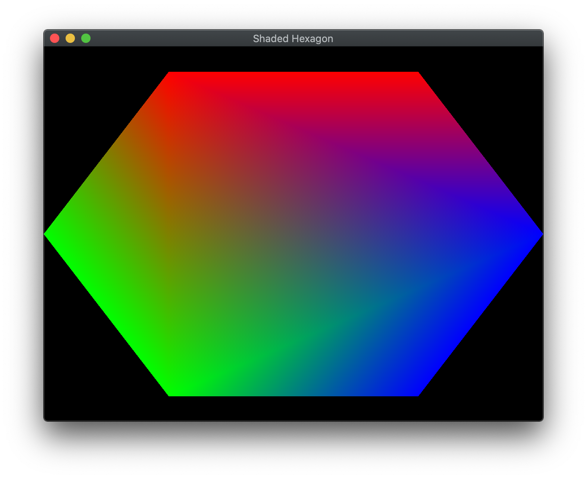

In the last lab we built some simple geometry and rendered it using a vertex buffer. However, while the square only required *four* unique vertices to define the shape, we needed to store *six* vertices in the buffer to create the two triangles, i.e. we *duplicated* two vertices resulting in using *50%* more buffer memory than necessary. As our object geometries become more complicated both in terms of the number of vertices and as we expand the data associated with each vertex, the extra memory requirements can become a substantial issue. Thus, an alternative way of defining our geometry is to only store *unique* vertices in the vertex buffer (without concern to ordering), and then simply specify a set of *indices* that create the primitives. In this lab, we will also add colors to our vertices within the application that will then be passed with the coordinate data to the shaders.

## Getting Started

Navigate into the **CS370\labs** directory on your **H:** drive.

Download [CS370\_Lab02.zip](CS370_Lab02.zip), saving it into the **labs** directory.

Double-click on **CS370\_Lab02.zip** and extract the contents of the archive into a subdirectory called **CS370\_Lab02**

Open CLion, select **Open or Import** from the main screen (you may need to close any open projects), and navigate to the **CS370\_Lab02** directory. This should open the project and execute the [CMake](https://cmake.org) script to configure the toolchain.

## Defining Colors

In OpenGL, colors are typically represented by four components in the range [0.0,1.0] - (r, g, b, a) - where *r*, *g*, and *b* are the red, green, and blue channels respectively, and *a* is the alpha channel which we will use later when we discuss alpha blending, i.e. transparency. While you may be familiar with the color channels being integers in the range [0,255] (for 24/32-bit colors), OpenGL provides a more flexible representation as a floating point number in the range [0.0, 1.0] which works with *any* color depth representation.

The interesting part about OpenGL colors is they are defined at each *vertex*. Thus, if vertices in the object have different colors, OpenGL's default behavior is to perform *bilinear interpolation* to create a shaded *gradient* between the vertices.

Similarly to storing vertex coordinate data into a buffer, we will use the same commands to create and store the color data into a separate buffer.
 
### Tasks

- Add code to **build\_geometry()** to specify a *colors[][]* array of type **GLfloat** where the first vertex is blue, the next two vertices are red, the next two vertices are green, and the last vertex is blue (note for all colors we simply set the alpha channel to 1.0) using

```cpp
	// TODO: Define colors per vertex
	GLfloat colors[][4] = {
		{0.0f, 0.0f, 1.0f, 1.0f},
		{1.0f, 0.0f, 0.0f, 1.0f},
		{1.0f, 0.0f, 0.0f, 1.0f},
		{0.0f, 1.0f, 0.0f, 1.0f},
		{0.0f, 1.0f, 0.0f, 1.0f},
		{0.0f, 0.0f, 1.0f, 1.0f}
	};
```

- Add code to **build\_geometry()** to bind the *second* element (*ColBuffer*) from the *Buffers* array. **Hint:** The *Buffer\_IDs* enum will contain a list of symbolic constants indexing the *Buffers* array.

- Add code to **build\_geometry()** to load data from the *colors* array into the currently bound buffer. **Hint:** To get the size of the *colors* array use the **sizeof()** function, and set the usage flag to **GL\_STATIC\_DRAW**.

- Add code to **render\_scene()** to bind the *ColBuffer* element from the *Buffers* array

- Add code to **render\_scene()** to associate the shader variable location stored in *vCol*, with *colCoords* coordinates per vertex (which is set to 4), that are of type **GL\_FLOAT**, without normalization, no stride (since the data is tightly packed), and no offset using

```cpp
    glVertexAttribPointer(vCol, colCoords, GL_FLOAT, GL_FALSE, 0, NULL);
```

- Add code to **render\_scene()** to enable the attributes using the shader location *vCol* using

```cpp
    glEnableVertexAttribArray(vCol);
```

At this point if we render our geometry using **glDrawArrays()** you should see two separate gradient filled triangles. Interestingly enough, if we use a different primitive type known as a **GL\_TRIANGLE\_FAN** we actually get a hexagon. See Chapter 3 of the textbook for more information on OpenGL graphics primitives.

## Indexed Geometry

Now that we have our vertices and colors defined, we will create an array of *indices* that specify which vertices belong to which triangles in our object. To create a hexagon, one possible *tessellation*, i.e. division into triangles is shown below

> 

By using an index array, we avoid storing duplicate vertex data. We will see later how modeling programs utilize this same approach when representing more complex shapes.

After we create the index array, we will place the data into an *element* (index) array buffer object using a similar procedure to storing the vertex data.

### Tasks

- Add code to **build\_geometry()** to specify a *indices[]* array of type **GLushort** with a list of vertex indices for each of the four triangles shown in the hexagon figure above. **Note:** Be sure to use proper orientation for each triangle. When you are finished, there should be 12 indices total (4 triangles each with 3 vertices).

- Add code to **build\_geometry()** to bind the *third* element (*IndexBuffer*) from the *Buffers* array. **Hint:** The *Buffer\_IDs* enum will contain a list of symbolic constants indexing the *Buffers* array.

- Add code to **build\_geometry()** to load data from the *indices* array into the currently bound buffer using **GL\_ELEMENT\_ARRAY\_BUFFER** as the *target*. **Hint:** To get the size of the *indices* array use the **sizeof()** function, and set the usage flag to **GL\_STATIC\_DRAW**.

## Rendering Indexed Geometry

We can draw indexed geometry using 

```cpp
void glDrawElements(GLenum mode, GLsizei count, GLenum type, const GLvoid *indices);
```

where *mode* is again the primitive type to use for drawing, *count* is the number of indices (i.e. vertices) to draw, *type* is the data type of the indices, and \**indices* is the offset into the index buffer to start at.

### Tasks

- Add code to **render\_scene()** to draw the indexed geometry using **GL\_TRIANGLES**, using *numIndices* (defined as 12), of type **GL\_UNSIGNED\_SHORT**, and with **NULL** offset. 

## Compiling and running the program

You should be able to build and run the program by clicking the small green arrow towards the right of the top toolbar.

At this point you should see a gradient filled hexagon.

> 

To quit the program simply close the window.

Congratulations, you have now rendered slightly more complex geometry.

Next we will learn how to manipulate our objects using *transformations*.
