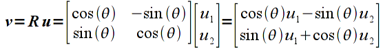

Linear algebra, i.e. the manipulation of *vectors* and *matrices*, has a fundamental role in computer graphics. While a thorough understanding of linear algebra is not necessary to program computer graphics, a working knowledge is beneficial when developing graphics applications. The graphics pipeline is optimized to perform certain linear algebra computations in a single (vector) operation. In particular, seemingly different quantities, e.g. vertices, colors, textures, etc., can all be represented in a similar manner as a *vector* and manipulated using identical linear algebra operations with *matrix multiplication*. 

We will use *matrices* from linear algebra to define several common *affine* transformations - including *scaling*, *rotation*, and *translation* - which are ones that are *line preserving*. This property means that to transform all the (infinitely many) points along a line, we only need to tranform the end points (and the rest will lie on the line segment between the transformed end points). Hence, by extension of this principle to polygons, we can transform one polygon into another polygon (although possibly with modified angles) by simply transforming the *vertices* that define the polygon. Thus, rather than continually defining new geometry for similar shapes (e.g. different sized rectangles), we can create **one** *template* object and then reuse this template to create several variants using scaling, rotation, and translation *transformations*. Finally we can apply multiple transformations by *concatenating* these transformations together, i.e. multiplying their respective matrices, to achieve additional effects. We will store these transformations in the *model transformation matrix* which will be passed to the shader. We will utilize functions in the **vmath.h** header to handle most of these operations.

## Getting Started

Navigate into the **CS370\labs** directory on your **H:** drive.

Download [CS370\_Lab03.zip](CS370_Lab03.zip), saving it into the **labs** directory.

Double-click on **CS370\_Lab03.zip** and extract the contents of the archive into a subdirectory called **CS370\_Lab03**

Open CLion, select **Open or Import** from the main screen (you may need to close any open projects), and navigate to the **CS370\_Lab03** directory. This should open the project and execute the [CMake](https://cmake.org) script to configure the toolchain.

## Basic Linear Algebra

**Terminology**

The fundamental concepts of linear algebra consist of *vectors* and *matrices*. We can think of a vector as a *column* of values (known as *components* of the vector). Hence a point in 2D space (x,y) would be represented by the vector

> 

A *matrix* can be conceptualized as a *table* of values. Hence a 2x2 matrix (known as the *dimension* or *size* of the matrix where the first number represents the number of *rows* while the second number represents the number of *columns*) would be represented as

> 

The *elements* of a matrix are typically indexed by row and column as shown above. Note that a vector is simply a special case of a matrix with a single column, i.e. an nx1 matrix. While technically a 1xn matrix, i.e. a single row, is often also referred to as a vector, we will reserve the term vector for a single column. Furthermore, matrices with the same number of rows as columns is known as a *square* matrix.

Vectors are typically represented programmatically as a 1D array while matrices are represented by a multi-dimensional array with corresponding element indexing.

**Vector/Matrix Operations**

**Addition**

Addition is done componentwise for vectors/matricies that have the *same* dimensions. Hence adding two vectors

> 

would give

> 

Similarly, adding matrices

> 

would give

> 

However the computation

> 

would be undefined since the two operands are of different sizes.

**Multiplication**

Multiplication is done for vectors/matrices that have matching *inner* dimensions, i.e. the number of *columns* of the first operand must be the same as the number of *rows* of the second operand. The resulting matrix will have a size corresponding to the *outer* dimensions, i.e. will have the same number of *rows* as the first operand and the same number of *columns* of the second operand. The elements of the resulting matrix are computed using the *sum-of-products* rule as shown below for a matrix multiplied by a vector (note a 2x2 matrix multiplied by a 2x1 vector results in a 2x1 vector, i.e. a vertex is *transformed* to a new vertex)

> 

and a matrix multiplied by a matrix

> 

In general, for two matrices (including vectors) **R** ( *m* x *k* ) and **S** ( *k* x *n* ) the elements of the resulting product matrix **M** (of dimension *m* x *n* ) can be computed as

> 

**Note:** Unlike regular arithmetic multiplication, matrix multiplication is **not** commutative, i.e. *order is important*. Hence if we multiply the same two matrices as above in the opposite order the result is

> 

which in general will be different than the first product (there are certain special cases where they will be the same but we will assume that *order matters*). This property will become extremely important when we begin concatenating transformation matrices.

**vmath.h**

Fortunately for us, we will use a library which provides vector and matrix datatypes along with functionality to create and manipulate these datatypes that correspond to our graphics operations.

The library defines two datatypes each with several variants:

- **vec[2,3,4]** will define a vector of *n* *floating point* values, e.g. **vec4 color;** would define a variable named *color* that stores 4 floating point values
- **mat[2,3,4]** will define a *square* matrix of *n*x*n* *floating point* values, e.g. **mat3 trans** would define a variable named **trans** that stores a 3x3 set of floating point values

We can also create vectors and matrices with other datatypes by prepending *i* (int), *u* (unsigned int), or *d* (double). We can initialize a vector using a corresponding **vec?** object, e.g. 

```cpp
vec3 color = vec3(1.0f, 0.0f, 0.0f);
```

We will not typically initialize matrices directly, but rather create the matrices using various functions discussed below.

## Scaling Transformations

The simplest transformations to apply are *scaling* transformations which simply multiply each component of a vector by a given amount known as the *scale factor*. If the scale factor is the same for all components, then the transformation is called a *uniform* or *isotropic* scaling (i.e. identical distortion in all directions), otherwise it is a *nonuniform* or *anisotropic* scaling (different distortions for different directions). If the scale factors are negative, the image is also *mirrored* about that axis. Mathematically, we can represent a 2D scaling with a *scaling matrix* transformation given by

> 

where *sx* is the scale factor in the x direction and *sy* is the scale factor in the y direction. Applying this transformation to a vector *u* gives

> 

which we can clearly see scales each component of the vector by the corresponding scale factor.

Rather than have to create the transformation matrix manually, the library provides the following functions to create a scaling matrix 

```cpp
mat4 scale(float x, float y, float z);
mat4 scale(vec3 scaleFactors);
```

where *x*, *y*, and *z* (or alternatively the corresponding components of a **vec3**) are the scale factors in the *x*, *y*, and *z* dimensions respectively. For 2D vertices, simply set the *z* factor to 1.

*NOTE:* The scaling is applied *relative to the origin*, thus if the object is not centered about the origin, the scaling will also *translate* the center of the object by a corresponding amount.

### Tasks

- Add code to **render\_scene()** to create a scaling matrix with scale factors 0.5 in the *x* and *y* dimensions and store the matrix in the *scale\_matrix* variable (which is of type **mat4**). **Hint:** Since we are in 2D, set the *z* scale factor to 1.0.

- Add code to **render\_scene()** to set the *model\_matrix* variable to *scale\_matrix*

- Uncomment the rendering code to draw a scaled red hexagon. **Note:** Code is provided to pass the model matrix and a color vector to the shader.

## Rotation Transformations

The next common type of transformation we wish to apply is a *rotation* about a given axis (which in 2D will simply be the *z-axis* which is perpendicular to the screen). Rotation angles are defined *counterclockwise* with respect to the origin (i.e. follow the *right-hand rule*). The rotation matrix for an angle θ is given by

> 

Applying this transformation to a vector **u** gives

> 

which is not so obvious that the correct rotation is obtained.

The library function to create a rotation matrix is

```cpp
mat4 rotate(float angle, float x, float y, float z);
mat4 rotate(float angle, vec3 axis);
```

where *angle* is the angle of (counterclockwise) rotation *in degrees* and *x,y,z* (or *axis*) is a vector for the *axis of rotation*. For 2D vertices, simply set the axis to (0.0,0.0,1.0) (i.e. rotation about the *z-axis*). 

*NOTE:* Again, rotation is applied *relative to the origin*, thus if the object is not centered about the origin, the rotation will also *translate* the center of the object by a corresponding amount.

### Tasks

- Add code to **render\_scene()** to create a rotation matrix by 90 degrees about the (0.0,0.0,1.0) axis (the *z*-axis) and store the matrix in the *rot\_matrix* variable (which is of type **mat4**). **Hint:** Consider creating a vec3 argument for the axis.

- Add code to **render\_scene()** to create a scaling matrix with scale factors 0.25 in each dimension and store the matrix in the *scale\_matrix* variable (which is of type **mat4**). **Hint:** Since we are in 2D, set the *z* scale factor to 1.0.

- Add code to **render\_scene()** to set the *model\_matrix* variable to the *product* of *rot\_matrix* and *scale\_matrix*. **Hint:** Since both matrices are **mat4**, you can simply use the \* operator to multiply them resulting in a **mat4** result.

- Uncomment the rendering code to draw a scaled and rotated green hexagon. **Note:** Code is provided to pass the model matrix and a color vector to the shader.

## Translation Transformations

Mathematically, translation is achieved by simply adding a fixed offset to each component of a vector. Hence we can write this operation using vector notation (for a 2D vector) as

> 

where *dx* is the offset in the *x* direction and *dy* is the offset in the *y* direction.

However, since the graphics pipeline is only designed to perform matrix *multiplication*, translation would either need to be done within the application or additional hardware would be needed on the graphics card to perform translations. Recall that matrix multiplication is a *sum-of-products* and hence we can perform vector addition through a matrix multiplication using *homogeneous coordinates*. We simply extend each vector by an additional component which is set to the value 1, and then the transformation matrices that require addition use values in the *last column* that multiply this extended component. In OpenGL, *all* vectors and matrices are represented internally in homogeneous coordinates so from the application programmer's standpoint it is transparent. Thus in 2D (which means 3D homogeneous coordinates), the translation transformation matrix is given by

> 

which when multiplied by a 2D vector (which is 3D in homogeneous coordinates), gives

> 

that is clearly identical to the vector addition above in *homogeneous coordinates*.

The library function to create a translation matrix is

```cpp
mat4 translate(float x, float y, float z);
mat4 translate(vec3 delta);
```

where *x*, *y*, and *z* (or alternatively the corresponding components of a **vec3**) are the translation offsets in the *x*, *y*, and *z* dimensions respectively. For 2D vertices, simply set the *z* offset to 0.

*NOTE:* Unlike the previous two transformations which were *relative to the origin*, translation is only an offset thus can be applied to objects in any position regardless of their relative position to the origin. Also the translations are *relative* to the *current* position of the object and is **not** an absolute positioning.

### Tasks

- Add code to **render\_scene()** to create a translation matrix with an offset of 0.5 in *x* and *y* and store the matrix in the *trans\_matrix* variable (which is of type **mat4**). **Hint:** Since we are in 2D, set the *z* offset to 0.0.

- Add code to **render\_scene()** to create a rotation matrix by 90 degrees about the (0.0,0.0,1.0) axis (the *z*-axis) and store the matrix in the *rot\_matrix* variable (which is of type **mat4**). **Hint:** Consider creating a vec3 argument for the axis.

- Add code to **render\_scene()** to create a scaling matrix with scale factors 0.25 in each dimension and store the matrix in the *scale\_matrix* variable (which is of type **mat4**). **Hint:** Since we are in 2D, set the *z* scale factor to 1.0.

- Add code to **render\_scene()** to set the *model\_matrix* variable to the *product* of *trans\_matrix*, *rot\_matrix*, and *scale\_matrix*. **Hint:** Since all three matrices are **mat4**, you can simply use the \* operator to multiply them resulting in a **mat4** result.

- Uncomment the rendering code to draw a scaled, rotated, and translated yellow hexagon. **Note:** Code is provided to pass the model matrix and a color vector to the shader.

## Instance Transformations

Often times we will wish to have similar objects with different scalings and rotations that are positioned throughout the scene. One very convienient way to accomplish this effect is to create a *template* object that is centered at the origin with "unit" size. Then for each instance of the object we wish to create, we simply scale, rotate, and translate the object into its proper size, orientation, and location in the scene. The proper mathematical order for this sequence is

> 
> 

The library allows for the \* operator to be used with **mat4** objects to perform matrix multiplication, thus if we have created scaling, rotation, and translation matrices named *sc*, *rot*, and *trans* using the functions discussed above, we could create an instance transformation as

```cpp
mat4 inst = trans*rot*sc; 
```

**NOTE:** Make sure you observe the order of the transformations since in general they will *not* commute, i.e. a different order will produce a different net transformation.

As a followup to instance transformations, to apply a scaling and/or rotation to an object in an arbitrary location (x,y,z), simply *translate it to the origin* (translate by (-x,-y,-z)), apply the desired scalings and rotations, then *translate back to the original location* (translate by (x,y,z)).

## Tasks

- Observe the order of multiplication of the various transformation matrices since matrix multiplication is typically **not** commutative. Try different orderings and different argument values to see what results they produce.

## Compiling and running the program

You should be able to build and run the program by clicking the small green arrow towards the right of the top toolbar.

At this point you should see a gradient filled hexagon.

> 

To quit the program simply close the window.

Congratulations, you have now used transformations to manipulate the size, orientation, and location of objects.

Next we will discuss how to incorporate keyboard and mouse input along with create animations using GLFW callbacks.
