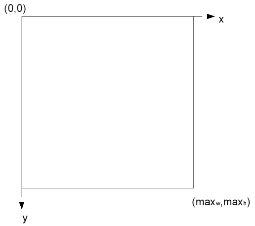
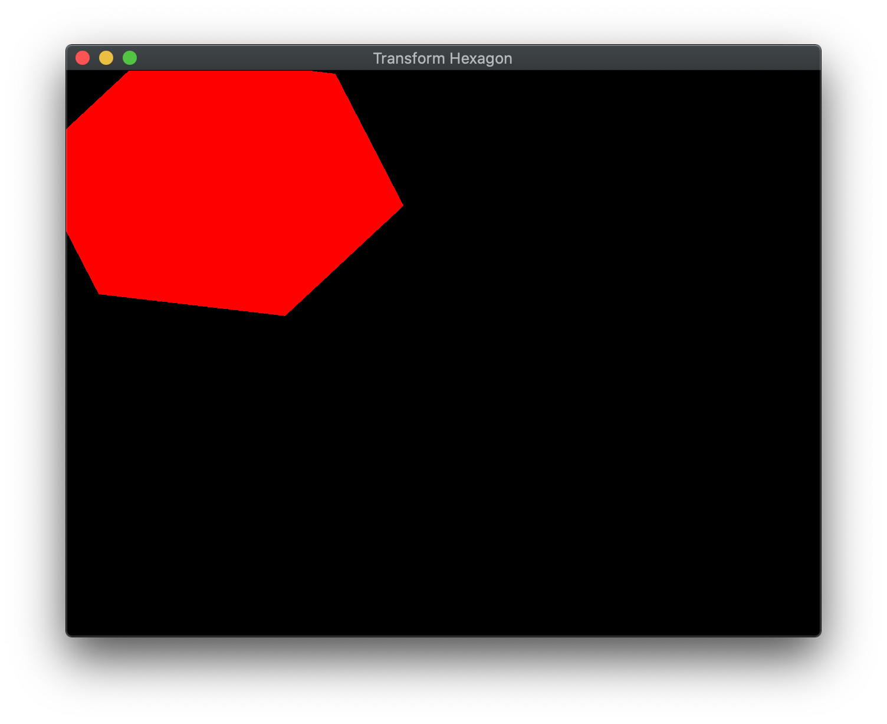

Last lab we finished the basic transformations in 2D (which extend directly to 3D). At this point, however, we can only create *static* scenes. A more useful system would allow for the user to interact with the graphics (through the keyboard and/or mouse) to modify the scene. Also the capability to dynamically change the scene without user interaction, i.e. animation, would further enhance the appearance of our programs. Together these two features give us the ability to write simple games that we will later be able to render in 3D with more sophisticated effects.

Both user interaction and animation utilize the *event driven* nature of the operating system. Fortunately, GLFW has taken care of wrapping this functionality into callback routines that are relatively easy to implement, for more information see the [GLFW input guide](https://www.glfw.org/docs/latest/input_guide.html). However, if more complicated user input behavior is needed, one would need to resort to using the various OS commands for handling keyboard and mouse event messages (beyond the scope of this course). One of the advantages of DirectX is that Microsoft directly provides this functionality at the expense of cross platform compatibility, particularly when using C\#.

Unfortunately, since we cannot have return values, nor can we add additional reference parameters to the callback prototypes, we must use *global variables* to store *state* values for the objects we wish to update in these routines. Then after processing the input event and updating the appropriate states, the next iteration of the graphics loop will render the scene with these updated values. We can implement these states efficiently by using instance objects with corresponding global transformation matrices (refer to [lab03](lab03.html) and then simply update these transformations in the callback routines. Furthermore, if we also update a state with each iteration of the graphics loop (usually in a time dependent fashion) we can produce *animations*.

## Getting Started

Navigate into the **CS370\labs** directory on your **H:** drive.

Download [CS370\_Lab04.zip](CS370_Lab04.zip), saving it into the **labs** directory.

Double-click on **CS370\_Lab04.zip** and extract the contents of the archive into a subdirectory called **CS370\_Lab04**

Open CLion, select **Open or Import** from the main screen (you may need to close any open projects), and navigate to the **CS370\_Lab04** directory. This should open the project and execute the [CMake](https://cmake.org) script to configure the toolchain.

## Keyboard Input

Keyboard input is handled via a *keyboard callback*. This callback has the signature

```cpp
void key_callback(GLFWwindow* window, int key, int scancode, int action, int mods);
```

where *window* is the current window, *key* is the [pressed key](https://www.glfw.org/docs/latest/input_guide.html) (e.g. **GLFW\_KEY\_A**, etc.), *scancode* are system specific codes for additional keys, *action* is the state if the key (**GLFW\_PRESS**, **GLFW\_REPEAT**, or **GLFW\_RELEASE**), and *mods* are any [modifier keys](https://www.glfw.org/docs/latest/group__mods.html) simultaneously pressed (e.g. **GLFW\_MOD\_SHIFT**, **GLFW\_MOD\_CONTROL**, etc.) Thus within the callback, you can query the state and value of the key pressed to decide on appropriate actions, e.g.

```cpp
    if (key == GLFW_KEY_SPACE && action == GLFW_PRESS ) {
        // Perform jump action
    }
```

In order to tell the system which callback function to execute when a keyboard event occurs, we will *register* the callback (usually in **main()** after creating the window) using

```cpp
glfwSetKeyCallback(window, key_callback);
```

where *window* is the reference to the current window and *key\_callback* is the name of the keyboard callback routine.

### Tasks

- Add code to **key\_callback()** to check for the following keys

    - **GLFW\_KEY\_UP** (up arrow) should increase *hex\_y* by *delta*
    
    - **GLFW\_KEY\_DOWN** (down arrow) should decrease *hex\_y* by *delta*

    - **GLFW\_KEY\_LEFT** (left arrow) should decrease *hex\_x* by *delta*
    
    - **GLFW\_KEY\_RIGHT** (right arrow) should increase *hex\_x* by *delta*

- Add code to **main()** to register the *key\_callback* keyboard callback

- Add code to **render\_scene()** to create the translation matrix *trans_matrix* with offsets *hex\_x* and *hex\_y*. **Note:** Since we are in 2D, set the *z* offset to 0

## Mouse Input

Mouse input is handled by several mouse callbacks, the two most commonly used ones are the *mouse button callback* and the *mouse motion* (cursor) *callback*.

**Mouse Button Callback**

The mouse button callback is used to process mouse button click events. It has the signature

```cpp
void mouse_button_callback(GLFWwindow* window, int button, int action, int mods);
```

where *window* is the current window, *button* is the [clicked button](https://www.glfw.org/docs/latest/group__buttons.html) (e.g. **GLFW\_MOUSE\_BUTTON\_LEFT**, **GLFW\_MOUSE\_BUTTON\_RIGHT**, etc.), *action* is the state of the button (e.g. **GLFW\_PRESS** or **GLFW\_RELEASE**), and *mods* are any [modifier keys](https://www.glfw.org/docs/latest/group__mods.html) simultaneously pressed (e.g. **GLFW\_MOD\_SHIFT**, **GLFW\_MOD\_CONTROL**, etc.) If within the callback you would like to retrieve the current cursor position, you can use

```cpp
void glfwGetCursorPos(GLFWwindow* window, double* xpos, double* ypos);
```

where *window* is the current window, *xpos* is a *reference* (i.e. &) to a double variable to store the *x* position, and *ypos* is a *reference* (i.e. &) to a double variable to store the *y* position. **Note:** These positions are *screen coordinates* in *pixels* within the window relative to the (0,0) upper left-hand corner of the window. See below for more information regarding screen coordinates. Thus within the callback, you can query the state and value of the key pressed to decide on appropriate actions, e.g.

```cpp
    if (button == GLFW_MOUSE_BUTTON_LEFT && action == GLFW_PRESS ) {
        // Fire a weapon
    }
```

In order to tell the system which callback function to execute when a mouse button event occurs, we will *register* the callback (usually in **main()** after creating the window) using

```cpp
glfwSetMouseButtonCallback(window, mouse_button_callback);
```

where *window* is the reference to the current window and *mouse\_button\_callback* is the name of the mouse button callback routine.

**Mouse Motion (Cursor) Callback**

The mouse motion callback is used to process mouse movement events to retrieve the current cursor position in *screen coordinates*. Screen coordinates are measured in *pixels* with (0,0) being the upper left-hand corner of the window with the *x* axis increasing to the right and the *y* axis increasing downward. While there is an obvious relationship between screen coordinates and world coordinates in 2D, in 3D that relationship becomes ambiguous which can make *selecting* objects in the scene somewhat challenging.

> 

The mouse motion callback has the signature

```cpp
void cursor_position_callback(GLFWwindow* window, double xpos, double ypos);
```

where *window* is the current window, *xpos* is the cursor's current *x* position in screen coordinates, and *ypos* is the cursor's current *y* position in screen coordinates. **Note:** On some platforms, this callback can return sub-pixel values.  

Often this callback is used to measure a relative distance from a starting location (stored in a global state in the mouse button callback).

In order to tell the system which callback function to execute when a mouse motion event occurs, we will *register* the callback (usually in **main()** after creating the window) using

```cpp
glfwSetCursorPosCallback(window, cursor_position_callback);
```

where *window* is the reference to the current window and *cursor\_position\_callback* is the name of the mouse motion callback routine.


### Tasks

- Add code to **mouse\_callback()** to check for **GLFW\_MOUSE\_BUTTON\_LEFT** (left mouse button) being **GLFW\_PRESS** (pressed) and multiply *dir* by -1 (to flip the animation direction)

- Add code to **main()** to register the *mouse\_callback* mouse button callback

## Time-based Animation

We can achieve animation by updating the global state of our objects in the graphics loop. Ultimately we would like our animations to be system *independent* (assuming the user's system has sufficient graphics capabilities) by rendering based on *time*, e.g. at a fixed frame rate. Fortunately GLEW provides a [timer](https://www.glfw.org/docs/3.0/group__time.html) that can be used to do time-based rendering.

We can retrieve the elapsed time since GLFW was initialized using

```cpp
double glfwGetTime();
```

which will return the elapsed time in seconds but typically accurate to a few microseconds. 

Hence if we specify an animation rate for our objects, e.g. rpm (revolutions per minute) for rotation, then we can measure the elapsed time between frame renderings and update the global state by a corresponding amount. For example, if we want an object to spin at a rate of *rpm* and we measure an elapsed time of *dt* seconds, we can calculate the number of degrees the object should rotate by (where the factor of 360/60 converts rpm to deg/sec)

>    dang = rpm\*(360.0/60.0)\*dt

## Tasks

- Add code to **main()** to get the initial time and store the value in *elTime*

- Add code to **main()** (in the graphics loop) to get the current time and store the value in *curTime*

- Add code to **main()** (in the graphics loop) to update *hex\_angle* with a rate of *rpm* and the elapsed time calculated as *(curTime-elTime)*

- Add code to **main()** (in the graphics loop) to set *elTime* to *curTime*

- Add code to **render\_scene()** to create the rotation matrix *rot_matrix* with angle *hex\_angle* and axis (0.0, 0.0, 1.0) (the *z* axis)

## Compiling and running the program

You should be able to build and run the program by clicking the small green arrow towards the right of the top toolbar.

At this point you should see a spinning red hexagon that can be moved around the screen using the arrow keys and reverse its direction using the left mouse button.

> 

To quit the program simply close the window.

Congratulations, you have now added user inputs and animation into your scenes.

Next we will discuss how to create 3D objects using different projections and place a camera in the scene.
