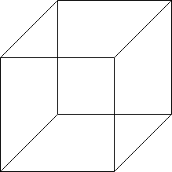
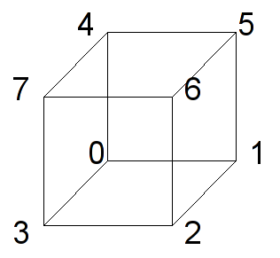
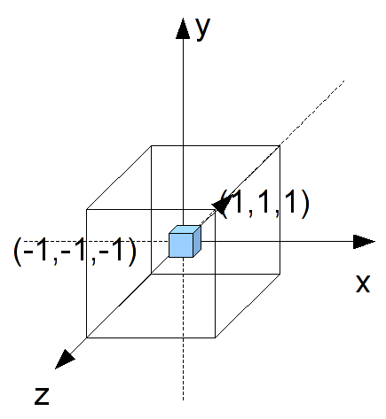
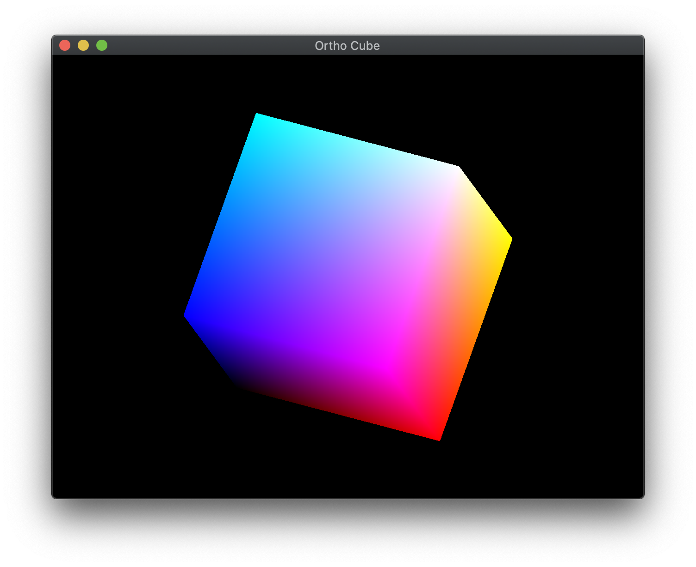

We are now ready to begin rendering 3D scenes. Unlike 2D, which has a direct correlation between world coordinates and screen coordinates, we must *project* our 3D world onto a 2D screen. The quality of our scenes, however, will depend on preserving some degree of *depth* of the objects within the world. We can accomplish this through a variety of visual cues such as occlusion (objects being partially blocked by other objects), lighting (object surfaces displaying color gradients), and perspective (the closer the object is, the larger it appears).

The simplest type of projection is known as *orthographic*, often used in engineering drawings. In this projection mode, the camera is assumed to be at an infinite distance, i.e. at +∞ looking in the -*z* direction. Thus *all* rays become parallel and objects will have the *same* height as they are in the world with parallel lines remaining parallel. For example, a cube drawn in orthographic projection would appear as (is the cube slanting downward to the left or upward to the right?)

> 

## Getting Started

Navigate into the **CS370\labs** directory on your **H:** drive.

Download [CS370\_Lab05.zip](src/CS370_Lab05.zip), saving it into the **labs** directory.

Double-click on **CS370\_Lab05.zip** and extract the contents of the archive into a subdirectory called **CS370\_Lab05**

Open CLion, select **Open or Import** from the main screen (you may need to close any open projects), and navigate to the **CS370\_Lab05** directory. This should open the project and execute the [CMake](https://cmake.org) script to configure the toolchain.

## 3D Geometry and the Depth Buffer

We define object geometry in 3D in the same manner as in 2D only now with each vertex having 3 components - (x,y,z). As a natural extension of our 2D world coordinate extents, in 3D space the extents of the rendered scene are [-1,1] for all three axes (we will change these extents later in this lab).

Unlike in 2D where objects were rendered via a *Painter's algorithm*, i.e. the last object rendered is the one that appears, in 3D we typically want the *closest* object to be the one that appears. Fortunately, OpenGL provides a way of automatically performing this occusion behavior (also known as *hidden surface removal* since those *surfaces* that are *hidden* behind other ones are *removed*) through the use of the *depth buffer*. This buffer keeps track of the depth of the closest object for each rendered pixel. As subsequent objects are rendered, only those whos pixels have a depth less than the current closest one stored in the buffer are rendered (subsequently also updating the depth buffer accordingly). To use the depth buffer, we must enable the depth test (which in subsequent labs we will temporarily disable for effects like transparency) using the command (usually in **main()** with the other initializations)

```cpp
glEnable(GL_DEPTH_TEST);
```

We must also clear the depth buffer every time we render the scene by adding the appropriate flag to the **glClear()** command at the beginning of the **display()** function

```cpp
glClear(GL_COLOR_BUFFER_BIT | GL_DEPTH_BUFFER_BIT);
```

Finally, when we create 3D geometry, we must be careful to order our vertices properly. Each polygon we create will have a *front face* and a *back face* which is defined by the right-hand rule. If we curl the fingers of our right hand to follow the vertex order, our right thumb will point in the direction of the *outward normal* (i.e. the *front face*). Since typically our objects are solid, for efficiency we can tell OpenGL to not render, i.e. cull, back faces using 

```cpp
glEnable(GL_CULL_FACE);
```

**Note:** Later we will discuss viewing volumes, so if an object is partially clipped by the viewing volume, culling back faces will cause the entire object to disappear rather than rendering the back faces, i.e. inside surface, of our objects. 

### Tasks

- Add code to **main()** to *enable* the depth buffer via the **GL\_DEPTH\_TEST** flag.

- Add code to **main()** to *enable* back face culling via the **GL\_CULL\_FACE** flag.

- Add code to **display()** to clear the depth buffer via the **GL\_DEPTH\_BUFFER\_BIT** flag. What happens if you forget to do this?

- Add code to **build\_geometry()** to initialize the **indices[]** array for all six faces based on the provided vertices which are shown in the figure below. **Hint:** You will need two triangles (with proper orientation) for each of the six faces, thus there should be 24 indices. Had we used separate vertices for each face, we would have used **three times** the amount of memory for the vertex buffer.

> 

At this point you should be able to render the scene but it may appear odd since the cube faces are as large as the view window. Note what happens if you do not enable the depth test or back face culling.

## Orthographic Projection

Often it is convienient to define the geometry of the objects in our world without having to scale everything to fit within the default extents of [-1,1]. This will usually produce a visually poor scene (or nothing rendered at all). Thus we want to be able to adjust the *viewing volume*, i.e. the extents of our rendered world, so that the objects appear and fill the screen as we wish. For *orthographic projection*, the viewing volume will be a rectangular parallelapiped (rectangular "cube") such that the default camera is at the origin looking *down* the *z* axis in the negative direction.

> 

To change the extents, we will set the *projection matrix* by creating an orthographic viewing volume with our desired extents using

```cpp
mat4 ortho(float left, float right, float bottom, float top, float near, float far);
```

where *left* and *right* are the *x* extents, *bottom* and *top* are the *y* extents, and *near* and *far* are the *z* extents. These values are measured *from the camera* whose default position is the *origin* (thus for now these values are the world extents).

### Tasks

-   Add code to **display()** to set *proj\_matrix* to an *orthographic* projection with extents [-2.0,2.0] for all three axis.

You should now see the entire cube rendered in the center of the screen.

## Resize callback

Observe that while we were able to see the entire cube after creating a larger orthographic viewing volume, the cube faces appear *rectangular*. This is due to the fact that while we have a cubical viewing volume, the *aspect ratio* of the window is not 1:1, i.e. it is wider than it is high. Thus objects will appear stretched in the horizontal direction. This is further exacerbated if the *user* decides to resize the window which will further distort the proportions of our rendered objects. This effect is known as *isotropic scaling*.

If, however, we would like our objects to maintain their original aspect ratios, e.g. squares remain square, we can add *anisotropic scaling* to our scenes through manipulation of the orthographic viewing volume extents based on the window dimensions. These dimensions can be queried using

 ```cpp
void glfwGetFramebufferSize(GLFWwindow *window, int *width, int *height);
```

where *window* is the current window, and \**width* and \**height* are references to the current window size. 

We can also retrieve these values whenever the user resizes the window through the [framebuffer size](https://www.glfw.org/docs/3.3/window_guide.html#window_fbsize) callback which has the signature

```cpp
void framebuffer_size_callback(GLFWwindow *window, int width, int height);
```

where *window* is the window being resized, and *width* and *height* are the new sizes of the window. We can register the framebuffer size callback in a similar fashion to the other callbacks using

```cpp
glfwSetFramebufferSizeCallback(window, framebuffer_size_callback);
```

where *window* is the reference to the current window and *framebuffer\_size\_callback* is the name of the resize callback routine.

Thus if we store the window sizes in global variables when the window is initially created and anytime the user resizes the window, we can adjust our orthographic viewing volume accordingly to have a similar aspect ratio using 

```cpp
	// Adjust viewing volume (orthographic)
	GLfloat xratio = 1.0f;
	GLfloat yratio = 1.0f;
	// If taller than wide adjust y
	if(ww <= hh)
	{
		yratio = (GLfloat) hh/ (GLfloat) ww;
	}
	// If wider than tall adjust x
	else if (hh <= ww)
	{
		xratio = (GLfloat) ww/ (GLfloat) hh;
	}
	proj_matrix = ortho(-1.0f*xratio,1.0f*xratio,-1.0f*yratio,1.0f*yratio,-1.0f,1.0f);
```

## Tasks

- Add code to **main()** to get the initial window sizes storing the results in **ww** and **hh**

- Add code to **framebuffer\_size\_callback()** to update **ww** and **hh* with the *width* and *height* parameters

- Add code to **main()** to register the *framebuffer\_size\_callback* resize callback

- Add code to **display()** to create an *anisotropic* orthographic projection matrix and store it in *proj_matrix*

Now observe the shape of the cube as you change the aspect ratio of the window.

## Compiling and running the program

You should be able to build and run the program by clicking the small green arrow towards the right of the top toolbar.

At this point you should see a spinning cube with gradient colored faces.

> 

To quit the program simply close the window.

Congratulations, you have now rendered your first 3D scene.

Next we will discuss how to load models rather than build geometry manually, create a perspective projection, and place a camera in the scene.
