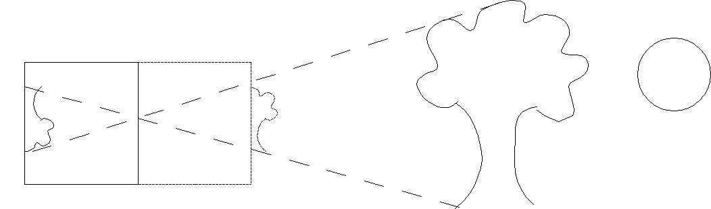
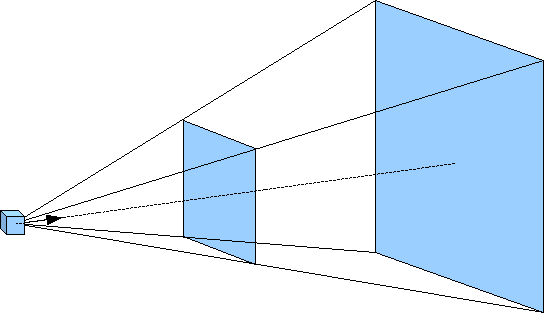
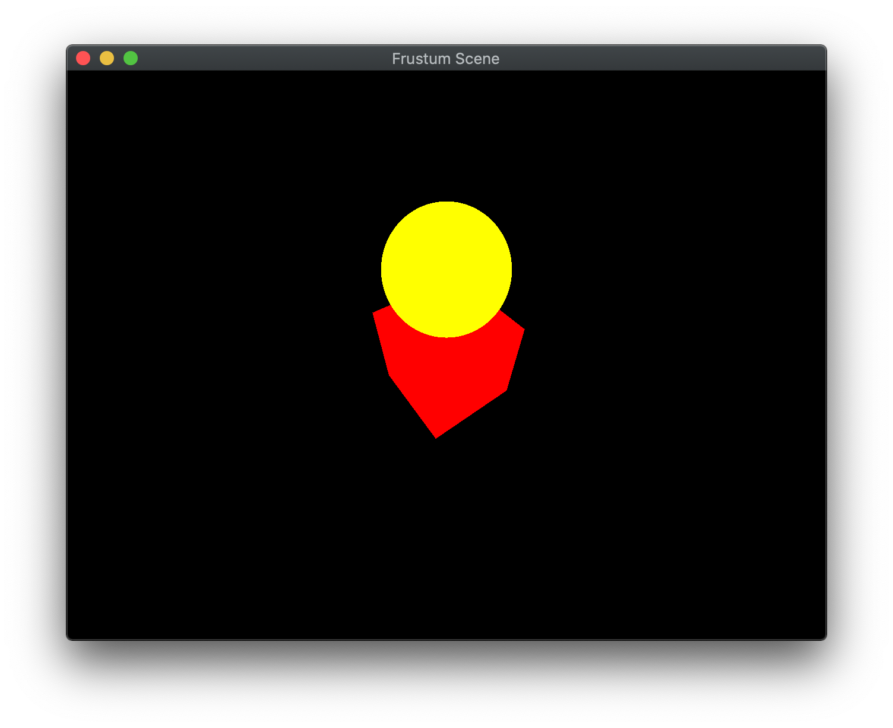

Orthographic projection is frequently used for *third-person* views (often static) where the objects are manipulated through transformations. However, when we create more realistic *first-person* views, we will use *perspective* projection where objects that are closer appear larger. Furthermore, particularly with perspective projection, *where* the viewer is, i.e. the *camera* location, will play an important role since the viewing volume will be defined *relative* to the camera's position and orientation. Fortunately, OpenGL allows us to define the objects in world coordinates and then simply place the camera at the desired location with a specified projection without worrying about all the underlying transformations (since by duality it does not matter whether the camera is fixed and the objects move or the objects are fixed and the camera moves).

We can think of the process of projection as taking a "picture" of the world from a particular camera location. The particular camera model we will use is the simplified *pinhole* camera where the aperature is a single pinhole. Light *rays* are drawn from every point in the world, through the pinhole, and onto the *projection plane* (i.e. film). This particular method clearly will have the closest objects along each ray being the ones appearing in the final scene.

> 

Since this model produces inverted images, we will assume that the projection plane is loacated an equal distance *in front* of the camera such that our images are right-side up.

We also will start rendering scenes with multiple objects. Rather than having to manually create geometry, especially for complicated objects, we will take advantage of *models* created with 3D modeling software, such as [3DS Max](https://www.autodesk.com/products/3ds-max/overview?support=ADVANCED&plc=3DSMAX&term=1-YEAR&quantity=1) or [Blender](https://www.blender.org), and use a *model loader* to import the geometry into our applications and store each object in its own buffers for rendering.

## Getting Started

Navigate into the **CS370\labs** directory on your **H:** drive.

Download [CS370\_Lab06.zip](src/CS370_Lab06.zip), saving it into the **labs** directory.

Double-click on **CS370\_Lab06.zip** and extract the contents of the archive into a subdirectory called **CS370\_Lab06**

Open CLion, select **Open or Import** from the main screen (you may need to close any open projects), and navigate to the **CS370\_Lab06** directory. This should open the project and execute the [CMake](https://cmake.org) script to configure the toolchain.

## Model Loader

Since OpenGL does not provide support for loading models, we will use functions from the included utility library *objloader.cpp*. This loader works with files saved in the **.obj** format. **Note:** This loader does not support all the possible features that can be represented in an **.obj** file, but will load vertices, normals, and texture coordinates for the model. While learning how to create models in modeling software will not be covered in this course, in a subsequent lab we will briefly learn how to generate some simple geometric shape models in Blender. The function to load an **.obj** model is

```cpp
void loadOBJ(const char *path, vector<vec4> &out_vertices, vector<vec2> &out_uvs, vector<vec3> &out_normals);
```

where *path* is the path to the **.obj** model file, *out_vertices* is a reference to a **vector\<vec4\>** (similar to an **ArrayList** in Java) to return the vertices, *out_uvs* is a reference to a **vector\<vec2\>** to return the texture coordinates (which we will use when we discuss texture mapping), and *out_normals* is a reference to a **vector\<vec3\>** to return the face normals (which we will use when we discuss lighting). Once we have loaded the information from the model into the return vectors, we can place these into our buffers for subsequent rendering.

The models can be rendered using a simple utility function which will bind the buffers passed as parameters and draw the geometry using **GL\_TRIANGLES**

```cpp
void draw_obj(GLuint VAO, GLuint Buffer, int numVert);
```

where *VAO* is the vertex array object, *Buffer* is the vertex data buffer, and *numVert* is the number of vertices to draw.

### Tasks

**NOTE:** The global array **models[]** contains the filenames for the **.obj** files.

- Add code to **build\_geometry()** to load the cube model. **Hint:** Use the *Cube* constant with the *models[]* array and pass references to the *vertices*, *uvCoords*, and *normals* vectors. Assign the *Cube* index of the *numVertices[]* array to the size of the *vertices* vector (using the **.size()** method)

- Add code to **build\_geometry()** to load the sphere model. **Hint:** Use the *Sphere* constant with the *models[]* array and pass references to the *vertices*, *uvCoords*, and *normals* vectors (after they have been cleared of prior data). Assign the *Sphere* index of the *numVertices[]* array to the size of the *vertices* vector (using the **.size()** method)

- Add code to **render\_scene()** to draw the cube object using the **draw\_obj()** function. **Hint:** Consider which elements of the **VAOs[]**, **Buffers[]**, and **numVertices[]** arrays to pass.

- Add code to **render\_scene()** to draw the sphere object using the **draw\_obj()** function. **Hint:** Consider which elements of the **VAOs[]**, **Buffers[]**, and **numVertices[]** arrays to pass.

Even though we should be rendering two objects, they will not appear as we have not set an appropriate viewing volume and positioned the camera such that they are visible.

## Perspective Projection

Unlike orthographic projection where parallel lines remain parallel and the size of an object is independent of its location relative to the camera, perspective projection is more akin to actual scenes. For example, two parallel railroad tracks *appear* to converge to a point in the distance and as objects move away from the observer, i.e. the camera, they get smaller in size. For this projection mode, rather than the viewing volume being a parallelapiped, it has a shape known as a *frustum*. This frustum can be visualized as a pyramid with its point at the camera but starting a small distance in front of the camera (known as the *near clipping plane*) and extending a further distance outward (known as the *far clipping plane*) as shown below.

> 

For a perspective projection, we will set the *projection matrix* by creating a frustum viewing volume with our desired extents (of the near clipping plane) using

```cpp
mat4 frustum(float left, float right, float bottom, float top, float near, float far);
```

where again *left* and *right* are the *x* extents of the near clipping plane, *bottom* and *top* are the *y* extents of the near clipping plane, and *near* and *far* are the *z* extents in world coordinate units of the near and far clipping planes respectively **FROM THE POSITION OF THE CAMERA in a direction along the camera's axis**. The default position for the camera is the world *origin* looking back down the *z* axis. However since the camera now is *within* the scene, *near* **must** be positive and *far* \> *near* (*be careful* not to make *near* too small).

**Note:** The larger and closer the near clipping plane is to the camera, the more the projection will cause distortion. A good rule of thumb to begin with is to set the *x* and *y* extents and the distance to the same values until the objects are in the scene, and then make adjustments to achieve the desired effect. 

### Tasks

- Add code to **display()** to set *proj\_matrix* to an *anisotropic frustum* projection with nominal extents [-1.0,1.0] for *x* and *y*, the near clipping plane 1 unit in front of the camera, and the far clipping plane 8 (or more) units in front of the camera.

While we have now set a reasonable viewing volume, the default camera is currently *inside* the cube with a near clipping plane beyond the back of the cube (and we are also culling back faces). See what happens if you disable back face culling and adjusting the near clipping plane distance.

## Camera Position

The default camera position is at the origin pointed in the *-z* direction, i.e. you *are* the center of the universe. We can, however, create a matrix to change this position and orientation using

```cpp
mat4 lookat(vec3 eye, vec3 center, vec3 up);
```

where *eye* are the world coordinates of the camera, *center* are the world coordinates where the camera is pointing, and *up* define a vector indicating which direction is up for the camera (since otherwise the camera could have any orientation about the axis defined by *eye* and *center*). 

Essentially, placing a camera in the scene transforms all objects in the scene from the world coordinate system to the camera coordinate system, i.e.  creates a *global* transformation. Thus, typically it will be created in the the **display()** function and later we will see that it gets multiplied in the shader prior to the modelview transformations. **Note:** If we wish to have some objects remain *stationary* with respect to the camera, e.g. a heads up display, we can either skip multiplying the camera transformation or set it (temporarily) to the identity matrix.

### Tasks

- Add code to **display()** to set *camera\_matrix* to position the camera at location *eye* pointed at location *center* oriented using *up*.

Now you should be able to see the objects rendered with a perspective projection.

## Spherical Coordinates

Often times when we wish to move the camera through a scene, simply adjusting the (x,y,z) components of the *eye* vector (with a corresponding adjustment of *center*) in Cartesian coordinates produces awkward behaviors. Instead, especially in a third person view, it is more natural if the camera is moved in *spherical coordinates* which consist of an *azimuth* angle (rotation about the *y* axis), an *elevation* angle (rotation down from the *y* axis), and a *radius* (distance from the origin), see the diagram below

> 

With this coordinate system, the camera appears to move around a sphere such that it rotates *around* the scene (azimuth), "up/down" in the scene (elevation), and "towards/away from" the center of the scene (radius). However, since *lookat* strictly uses Cartesian coordinates (i.e. (x,y,z)) the conversion from spherical to Cartesian coordinates is given by

> 

I have included code in the lab to initialize *eye* in **main()** and update it in **key_callback()** to revolve the camera around the scene by adjusting the azimuth and elevation angles using WASD and zooming in/out by adjusting the radius using ZX, and then recomputing the *eye* vector. 

## Compiling and running the program

You should be able to build and run the program by clicking the small green arrow towards the right of the top toolbar.

At this point you should see a spinning cube with gradient colored faces.

> 

To quit the program simply close the window.

Congratulations, you have now rendered your first 3D scene.

Next we will discuss how to load models rather than build geometry manually, create a perspective projection, and place a camera in the scene.
