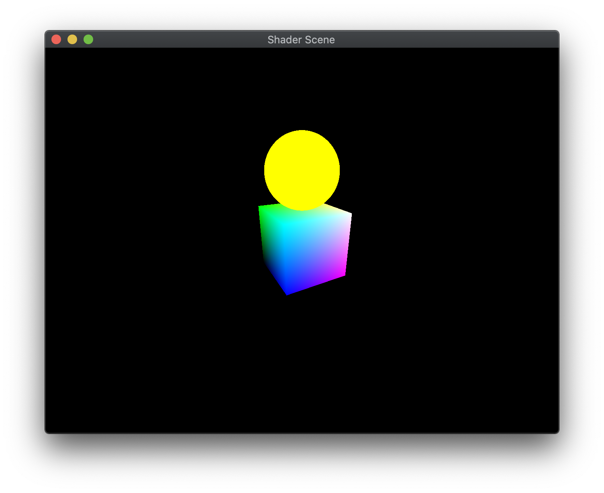

All vertices passed into the graphics card are processed by a multi-stage *graphics pipeline*. The graphics pipeline is optimized to process *graphics* (as opposed to a more general purpose computing pipeline such as on the CPU) which provides a great deal of efficiency and program simplicity at the expense of a limited number of operations. As a graphics programmer, it will be your task to utilize the pipeline to do as much work as possible on the graphics card rather than on the CPU. The stages of this pipeline are shown in the figure below:

> 

[https://www.khronos.org/opengl/wiki/Rendering\_Pipeline\_Overview](https://www.khronos.org/opengl/wiki/Rendering_Pipeline_Overview). **Note:** The stages shaded in blue are *programmable*, i.e. we can specify their behavior through shader code.

The two stages we will be considering in this course are:

-   **Vertex Shader** - performs coordinate transformations (including projection and camera transformations) and assigns vertex colors
-   **Fragment Shader** - applies pixel level effects such as texture mapping, per-pixel lighting, bump mapping, etc.

In this lab we will see how to load shaders from files and *use* them from within our programs by associating shader variables with references in our application.

## Getting Started

Navigate into the **CS370\labs** directory on your **H:** drive.

Download [CS370\_Lab07.zip](src/CS370_Lab07.zip), saving it into the **labs** directory.

Double-click on **CS370\_Lab07.zip** and extract the contents of the archive into a subdirectory called **CS370\_Lab07**

Open CLion, select **Open or Import** from the main screen (you may need to close any open projects), and navigate to the **CS370\_Lab07** directory. This should open the project and execute the [CMake](https://cmake.org) script to configure the toolchain.

## Loading Shaders

Shaders, like other source code files, are simply text files with a syntax similar to C. In order to create them, the **utils.cpp** contains a utility function we will use:

```cpp
GLuint LoadShaders(ShaderInfo* shaders);
```

where *shaders* is an array of type **ShaderInfo** which specifies which shader file to associate with which shader stage and returns a reference to a shader program built from these stages. For example, if we have two variables *vertex\_shader* and *frag\_shader* that contain the paths to shader source files, we can build a shader program using

```cpp
ShaderInfo shaders[] = { {GL_VERTEX_SHADER, vertex_shader},
                         {GL_FRAGMENT_SHADER, frag_shader},
                         {GL_NONE, NULL} };
program = LoadShaders(shaders);
```

### Creating Shader Programs

The **LoadShader()** function performs several steps using the shader files specified in the parameter. First, we need to read the shader text from the file and store it in a character array. **utils.cpp** provides a **ReadShader()** function to perform this task. Next we will create various references to the program and the separate shaders using

```cpp
GLuint glCreateProgram();
GLUint glCreateShader(GLenum shaderType);
```

where *shaderType* is the type of shader stage we are creating, e.g. **GL\_VERTEX\_SHADER**.

Next we will associate the shader source with the shader reference using

```cpp
void glShaderSource(GLuint shader, GLsizei count, const GLchar **string, const GLint *length);
```

where *shader* is the reference returned from **glCreateShader()**, *count* is the number of shaders we are associating, *string* is an array of source strings, and *length* is an array containing the string lengths.

Once the source is associated with the reference, we will *compile* each shader stage using

```cpp
void glCompileShader(GLuint shader);
```

where *shader* is the shader reference. We can check whether or not the compilation was successful using

```cpp
void glGetShaderiv(GLuint shader, GLenum pname, GLint *params);
```

where *shader* is the shader reference for the shader we attempted to compile, *pname* is the parameter we wish to query (e.g. **GL\_COMPILE_STATUS**), and \**params* is a reference to the return variable for the resulting query. Thus we can verify that the shader stage was compiled correctly, or retrieve some error log information if not.

If compilation was successful, we can then attach the shader to our program using

```
void glAttachShader(GLuint program, GLuint shader);
```

where *program* is the shader program reference and *shader* is the shader stage reference.

After we have compiled and attached all our stages, the last step is to *link* the stages to create the shader program using

```cpp
void glLinkProgram(GLuint program);
```

where *program* is the shader program reference. Similar to compilation, we can query if linking was successful using

```cpp
void glGetProgramiv(GLuint program, GLenum pname, GLint *params);
```

where *program* is the program reference, *pname* is the parameter we wish to query (e.g. **GL\_LINK\_STATUS**, and \**params* is a reference to the return variable for the resulting query. Thus we can verify that the program was linked correctly or retrieve some error log information if not.

Thus in our application we can create multiple shader programs using different vertex and fragment shader files if we wish to use different effects on different objects in our scene.

### Tasks

**NOTE:** The global variables **vertex\_shader**, **mesh\_shader**, and **frag\_shader** contain the filenames for the shader files. We will be using the *same* fragment shader with two different vertex shaders to create two shader programs.

- Add code to **main()** to create the shader program from the *mesh\_shaders[]* **ShaderInfo** array and store the resulting reference in *mesh\_program*. This shader will be used to render objects loaded from **.obj** files with solid color

- Add code to **main()** to create the shader program from the *grad\_shaders[]* **ShaderInfo** array and store the resulting reference in *grad\_program*. This shader will be used to render indexed objects with per vertex colors

You may wish to look at the code in **utils.cpp** to see how the **ShaderInfo** array is used to compile and link the various shader parts into a shader program.

## Shader Variable References

Once we have created a shader program, we need to associate a reference in our application with the input shader variables to allow us to set the values of these shader variables during rendering. There are several types of shader variables:

- **uniform** - values that are set once *per object* (i.e. are the same for all vertices), for example a transformation matrix or solid color

- **attribute** - values that are set once *per vertex* (i.e. they may be different for each vertex), for example a color for gradient fill or lighting normals

Thus to associate a reference in the application we will use either

```cpp
GLint glGetUniformLocation(GLuint program, const GLchar *name);
GLint glGetAttribLocation(GLuint program, const GLchar *name);
```

where *program* is the shader program and \**name* is a string with the *name* of the shader variable.

### Tasks

**NOTE:** The shader variable are defined in **color\_mesh.vert** and **color\_grad.vert**. Even though the shader variables have the same name, they are separate variables since they will be in separate shader programs.

- Add code to **main()** to set *mesh\_vPos* reference to the corresponding *vPosition* shader variable as an **attribute**

- Add code to **main()** to set the *mesh\_vCol*, *mesh\_model\_mat\_loc*, *mesh\_proj\_mat\_loc*, and *mesh\_cam\_mat\_loc* references to the corresponding shader variables as **uniform**s

- Add code to **main()** to set the *grad\_vPos* and *grad\_vCol* references to the corresponding *vPosition* and *vColor* shader variables as **attribute**s

- Add code to **main()** to set the *grad\_model\_mat\_loc*, *grad\_proj\_mat\_loc*, and *grad\_cam\_mat\_loc* references to the corresponding shader variables as **uniform**s

## Activating Shaders

Prior to rendering an object, we need to activate the shader we wish to use for rendering using

```cpp
void glUseProgram(GLuint program);
```

where *program* is the shader program to use.

### Tasks

- Add code to **render\_scene()** to use the *grad\_program* for the cube

- Add code to **render\_scene()** to use the *mesh\_program* for the sphere

## Passing Data to Shader Variables

Once we have references to the shader variables and selected the shader program we will be using, we can use the references for the program to pass the appropriate information when we render the objects. 

### Attribute Variables

Since attribute variables are set *per vertex* they are passed via the buffer objects. Thus after we bind the proper vertex array object and vertex buffer, we need to define the layout of each attribute component using

```cpp
void glVertexAttribPointer(Gluint index, GLint size, GLenum type, GLboolean normalized, GLsizei stride, const void *pointer);
```

where *index* is the shader variable reference, *size* is the number of coordinates in the attribute, *type* is the datatype for the elements, *normalized* indicates whether to normalize the values in the range [-1,1], *stride* is the offset between consecutive data in the buffer, and \**pointer* is the offset of the starting location for the data (despite its awkward signature).

We will enable these attributes using

```cpp
void glEnableVertexAttribArray(GLuint index);
```

where *index* is the reference to the corresponding shader variable location.

### Uniform Variables

We can set the value of *uniform* **vec4** *vector* shader variables from application variables using

```cpp
void glUniform4fv(GLint location, GLsizei count, const GLfloat *value);
```

where *location* is the shader variable reference, *count* is the number of shader variables we wish to set (1 for a single vector and more than 1 if the shader variable is an array of vectors), and \**value* is the application variable containing the vector data to be passed to the shader. **Note:** There are several other versions depending on the number of components to pass and the data type of the elements, see the [API](https://www.khronos.org/registry/OpenGL-Refpages/gl4/html/glUniform.xhtml).

For **mat4** *matrix* shader variables, we can use

```cpp
void glUniformMatrix4fv(GLint location, GLsizei count, GLboolean transpose, const GLfloat *value);
```

where *location* is the shader variable reference, *count* is the number of shader variables we wish to set (1 for a single matrix and more than 1 if the shader variable is an array of matrices), *transpose* is a flag specifying whether or not to transpose the matrix when it is passed, and \**value* is the application variable containing the matrix data to be passed to the shader. **Note:** There are several other versions depending on the size of the matrix to pass and the data type of the elements, see the [API](https://www.khronos.org/registry/OpenGL-Refpages/gl4/html/glUniform.xhtml).

### Tasks

- Add code to **render\_scene()** for the cube to define and enable the gradient vertex attributes *grad\_vPos* after the *CubePosBuffer* has been bound. Use *cubePosCoords* for the number of components in the position, **GL\_FLOAT** for the type, **GL\_FALSE** for normalization, 0 for the stride, and **NULL** for the offset.

- Add code to **render\_scene()** for the cube to define and enable the gradient vertex attributes for *grad\_vCol* after the *CubeColBuffer* has been bound. Use *cubeColCoords* for the number of components in the colors, **GL\_FLOAT** for the type, **GL\_FALSE** for normalization, 0 for the stride, and **NULL** for the offset.

- Add code to **draw\_obj()** for the mesh to define and enable the mesh vertex attributes for *mesh\_vPos* after the *Buffer* has been bound. Use *meshPosCoords* for the number of components in the position, **GL\_FLOAT** for the type, **GL\_FALSE** for normalization, 0 for the stride, and **NULL** for the offset.

- Add code to **render\_scene()** for the cube to pass *proj\_matrix*, *camera\_matrix*, and *model\_matrix* uniform matrices to the shader using their respective gradient shader references. We are only passing 1 matrix to each shader variable and do not need to transpose them (i.e. **GL\_FALSE**)

- Add code to **render\_scene()** for the sphere to pass *proj\_matrix*, *camera\_matrix*, and *model\_matrix* uniform matrices to the shader using their respective mesh shader references. We are only passing 1 matrix to each shader variable and do not need to transpose them (i.e. **GL\_FALSE**)

- Add code to **render\_scene()** for the sphere to pass the *sphere\_color* uniform vector to the shader using the *mesh\_vCol* mesh shader references. We are only passing 1 vector to the shader variable

## Compiling and running the program

You should be able to build and run the program by clicking the small green arrow towards the right of the top toolbar.

At this point you should see a gradient cube with a solid sphere on top that can be adjusted with a spherical coordinate perspective camera.

> 

To quit the program simply close the window.

Congratulations, you have now used multiple shaders to pass different object data for rendering.

Next we will discuss the basics of how to *write* our own shaders.
