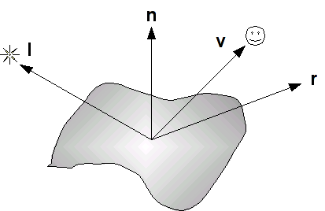
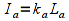
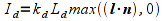
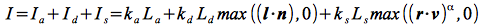
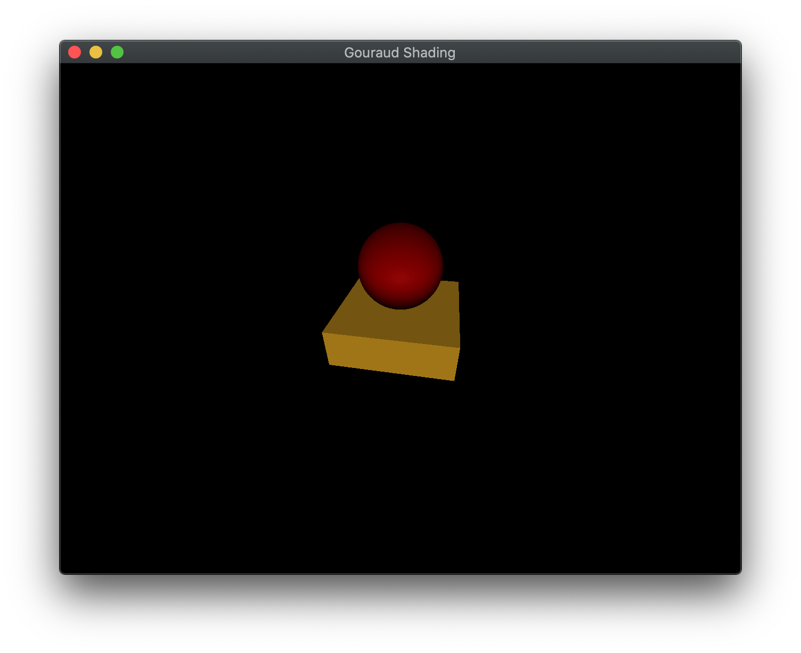

Now that we have completed creating 3D geometry, we would like to enhance our scenes through the application of shadowing caused by lighting. To do this we will use a simple lighting model known as the *Phong model*. This model consists of defining four *material* properties, three corresponding *light source* properties, and some additional geometry parameters controlling the interaction of the two. Unfortunately because the pipeline contains *no global information*, i.e. once an object is passed through the pipeline any world information regarding it is lost, we are only able to apply lighting on a per object basis. While this provides for some lighting effects, the pipeline is not able to handle *reflections* amongst objects. Thus a *shiny* object will not (for now) appear to be reflecting any other objects in the scene.

The Phong model can be implemented either in the *vertex shader* or *fragment shader*. When it is implemented in the vertex shader, it is known as Gouraud shading, which has the advantage of efficiency at the expense of visual quality. When it is implemented in the fragment shader, it is known as Phong shading, which is less efficient but has better visual appearance. In this lab we will implement simple Gouraud shading for a basic light source and then next lab add additional light sources with Phong shading.

## Getting Started

Navigate into the **CS370\labs** directory on your **H:** drive.

Download [CS370\_Lab09.zip](src/CS370_Lab09.zip), saving it into the **labs** directory.

Double-click on **CS370\_Lab09.zip** and extract the contents of the archive into a subdirectory called **CS370\_Lab09**

Open CLion, select **Open or Import** from the main screen (you may need to close any open projects), and navigate to the **CS370\_Lab09** directory. This should open the project and execute the [CMake](https://cmake.org) script to configure the toolchain.

## Materials

The basic model we will be using for lighting is known as the *Phong model*. In this model, every surface has a particular *material* associated with it. This material is defined by four properties

-   Ambient - overall background illumination
-   Diffuse - scattered light based on the "smoothness" of the surface
-   Specular - highlights based on the "shininess" of the surface
-   Shininess - the degree of concentration of the specular highlights

Each of the first three properties is defined by a four element vector with one component of each array per color channel. These values indicate the *percent* of the incident light channel that is *reflected*, hence the higher the value the more the object will appear to have that color. The last property, shininess, is simply a floating point (GLfloat) value. We will define a **MaterialProperties** structure in the **lighting.h** header file to define a particular material as follows

```cpp
struct MaterialProperties {
	vmath::vec4 ambient;
	vmath::vec4 diffuse;
	vmath::vec4 specular;
	GLfloat shininess;
	GLfloat pad[3];
};
```

(**Note:** The *pad* field is necessary for proper byte alignment in a uniform buffer that will be discussed later.)

We will then create **MaterialProperties** instances and specify the values for the various components. For example, to create a brass material

```cpp
MaterialProperties brass = {vec4(0.33f, 0.22f, 0.03f, 1.0f), //ambient
                            vec4(0.78f, 0.57f, 0.11f, 1.0f), //diffuse
                            vec4(0.99f, 0.91f, 0.81f, 1.0f), //specular
                            27.8f, //shininess
                            {0.0f, 0.0f, 0.0f}  //pad
};
```

Once we have created all our materials, similar to placing data in other buffers, we will create, bind, and load the data into a *uniform* buffer for our materials using the **GL\_UNIFORM\_BUFFER** type.

### Tasks

- Add code to **build\_materials()** to create a **MaterialProperties** variable named *brass* using the values given above

- Add code to **build\_materials()** to create a **MaterialProperties** variable named *redPlastic* using (0.3f, 0.0f, 0.0f, 1.0f) for the ambient, (0.6f, 0.0f, 0.0f, 1.0f) for the diffuse, (0.8f, 0.6f, 0.6f, 1.0f) for the specular, and 32.0f for the shininess. **Note:** Don't forget to also add the pad to the structure.

- Add code to **build\_materials()** to add the two materials to the *Materials* vector using the **push\_back()** method.

**Note:** Notice how the data is then loaded into a **GL\_UNIFORM\_BUFFER** in a similar fashion to other buffers.

## Light Sources

Similar to materials, each light source is defined by three properties - *ambient* (background), *diffuse* (scattered), and *specular* (focused). Again, each of these properties is specified using a (4 component) RGBA color array. The RGB channels describe the intensity for each color channel of the light source, e.g. (1,1,1) would produce white light. For now we will again simply set the alpha channel to 1. A **LightProperties** structure is defined in the **lighting.h** header file as follows

```cpp
struct LightProperties {
	GLint type;
	GLfloat pad1[3];
	vmath::vec4 ambient;
	vmath::vec4 diffuse;
	vmath::vec4 specular;
	vmath::vec4 position;
	vmath::vec4 direction;
	GLfloat spotCutoff;
	GLfloat spotExponent;
	GLfloat pad2[2];
};
```

Light sources will also have other properties such as *type*, *position*, *direction*, etc. depending on the type of light we wish to create. We will discuss the different types of lights in the next lab.(**Note:** Again the *pad* field is necessary for proper byte alignment in a uniform buffer that will be discussed later.) For example, to create a white light

```cpp
LightProperties whiteLight = {DIRECTIONAL, //type
                            	{0.0f, 0.0f, 0.0f}, //pad
                                vec4(0.0f, 0.0f, 0.0f, 0.0f), //ambient
                                vec4(1.0f, 1.0f, 1.0f, 1.0f), //diffuse
                                vec4(1.0f, 1.0f, 1.0f, 1.0f), //specular
                                vec4(0.0f, 0.0f, 0.0f, 1.0f),  //position
                                vec4(-1.0f, -1.0f, -1.0f, 0.0f), //direction
                                0.0f,   //cutoff
                                0.0f,  //exponent
                                {0.0f, 0.0f}  //pad2
};
```

### Tasks

- Add code to **build\_lights()** to create a **LightProperties** variable named *whiteLight* using the values given above

- Add code to **build\_lights()** to add the light to the *Lights* vector using the **push\_back()** method.

**Note:** Notice how the data is then loaded into a **GL\_UNIFORM\_BUFFER** in a similar fashion to other buffers.

## Phong Model and Normals

The Phong model computes the contribution of each lighting component (on a per channel basis) based on the relationship between four vectors as shown below

> 

where the four vectors are as follows:

-   **l** is a vector in the direction of the *light source*
-   **n** is the outward *surface normal*
-   **v** is a vector in the direction of the *viewer* (i.e. camera)
-   **r** is a vector in the direction of the *reflected* light (i.e. at the same angle with respect to the normal as the incident light)

These vectors determine the final intensity of the diffusive and specular lighting components that are applied to the surface.

### Normals

We will see that several of the components of the Phong model depend on the orientation of the surface with respect to the light source, thus to use lighting we must associate a *normal* with each vertex in our geometry. We will do this by creating an attribute buffer (similar to the color buffer from [Lab 2](lab02.html)), and loading the data for the normals either manually or from the model **.obj** file.

One issue we must address is that whenever we transform our objects, we must also perform a transformation of the normals. However, since normals are simply directions, they should not be affected by translations and we must be careful with non-uniform scalings which can change the direction of the normal vector. To correctly transform the normals, we will compute a *normal matrix* transformation based on the *model* transformation (the derivation is beyond the scope of this course) as the transpose of the inverse of the model matrix, i.e.

```cpp
normal_matrix = model_matrix.inverse().transpose();
```

### Phong Model

*Ambient Reflection*

The ambient reflection component is independent of the normals and can be thought of as an overall uniform illumination of the surface. Thus it is simply the product of the incident intensity with the material's ambient array components

> 

where *k*<sub>a</sub> is the material ambient component (per color channel), *L*<sub>a</sub> is the incident ambient light intensity, and *I*<sub>a</sub> is the final ambient light intensity per color channel.

*Diffuse Reflection*

The diffuse reflection component is based on *Lambert's law* which states that the more directly the light shines on the surface, the brighter it will appear. Mathematically this is computed using the *dot product* between  **n** (the surface normal) and **l** (the light direction). When these two vectors are *parallel* (light shining directly onto surface), the dot product is one and hence there is maximal diffusive illumination. When the two vectors are *perpendicular* (light shining across surface), the dot product is zero and hence there is no diffusive illumination. Hence the formula based on the material's diffusive array components is

> 

where *k*<sub>d</sub> is the material diffusive component (per color channel), *L*<sub>d</sub> is the incident diffusive light intensity, (**n** ⋅ **l**) is the Lambert factor (clipped to a minimum value of 0), and *I*<sub>d</sub> is the final diffusive light intensity. This formula can also be extended to account for the *attenuation* due to distance the object is from the light source.

*Specular Reflection*

The specular reflection component is used to create highlights on an object (particular for shiny materials). These reflections will be greatest when the reflected light (which depends on the surface normal and the direction of the light source) is in the direction of the viewer. Mathematically this is computed using the *dot product* between **r** (the reflected light direction) and **v** (the viewer direction). When these two vectors are *parallel* (viewer looking directly at reflection), the dot product is one and hence there is maximal specular illumination. When the two vectors are *perpendicular* (viewer looking across reflection), the dot product is zero and hence there is no specular illumination. The shininess property determines how *focused* the highlight is, a high shininess coefficient creates a small bright spot whereas a low shininess coefficient creates a broader less bright spot. The formula based on the material's specular array components is

> 

where *k*<sub>s</sub> is the specular component (per color channel), *L*<sub>s</sub> is the incident specular light intensity, (**r** ⋅ **v**) is the specular factor (clipped to a minimum value of 0), α is the shininess exponent for the material, and *L*<sub>s</sub> is the final specular light intensity. An attenuation factor can also be applied to this component to account for the distance between the object and the light source. However, this computation can be expensive since the reflection vector needs to be computed. Alternatively, an approximation to the specular term can be computed using the *halfway vector* (**h** = (**l** + **v**)/\|\|**l**+**v**\|\|) as **n**∙**h**

*Phong model*

The final intensity of each color channel is then simply the sum of the three reflection components as given by (not including attenuation)

> 

For Gouraud shading, we will implement this equation in the *vertex shader* and thus the lighting calculations, i.e. color, will be computed *per vertex* and then interpolated across the object. While this is more efficient for rendering, it may not produce as accurate of a visual effect.

### Tasks

- Add code to **render\_scene()** to compute the *normal\_matrix* variable as the transposed inverse of the model matrix for each object

- Add code to **gouraud.vert** in **main()** to compute **l** as the *negative* of the light direction (i.e. direction *towards* the light) as a **vec3**

    ```cpp
    vec3 LightDirection = -normalize(vec3(Lights[0].direction));
    ```
    
- Add code to **gouraud.vert** in **main()** to compute **n** by transforming the vertex normal by the normal matrix

    ```cpp
    vec3 Normal = vec3(normalize(norm_matrix * normalize(vec4(vNormal,0.0f))));
    ```
 
- Add code to **gouraud.vert** in **main()** to compute **v** as the vector from the transformed surface location (in world coordinates) to the camera position (eye)

    ```cpp
    vec4 Position = model_matrix*vPosition;
    vec3 View = normalize(EyePosition - Position.xyz);
    ```

- Add code to **gouraud.vert** in **main()** to compute **h** as the sum of the light direction and the view

    ```cpp
    vec3 HalfVector = normalize(LightDirection + View);
    ```

- Add code to **gouraud.vert** in **main()** to compute the *ambient* term

    ```cpp
    rgb += vec3(Lights[0].ambient*Materials[Material].ambient);
    ```

- Add code to **gouraud.vert** in **main()** to compute the *diffuse* term using Lambert's law

    ```cpp
    float diff = max(0.0f, dot(Normal, LightDirection));
    rgb += diff*vec3(Lights[0].diffuse*Materials[Material].diffuse);
    ```

- Add code to **gouraud.vert** in **main()** to compute the *specular* term using the halfway vector and the shininess coefficient (only if there is a diffuse term)

    ```cpp
        float spec = pow(max(0.0f, dot(Normal, HalfVector)),Materials[Material].shininess);
        rgb += spec*vec3(Lights[0].specular*Materials[Material].specular);
    ```

**Note:** In the fragment shader we will then clamp the color channel values to 1.
 
## Compiling and running the program

You should be able to build and run the program by clicking the small green arrow towards the right of the top toolbar.

At this point you should see a spinning sphere and cube object with a gradient lighting effect.

> 

To quit the program simply close the window.

Congratulations, you have now written an application with basic lighting.

Next we will investigate how to create different types of lights and move the Phong calculation into the fragment shader for better visual effect.
