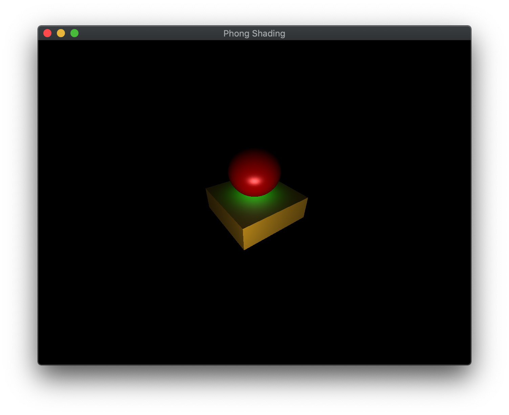

In the last lab we introduced basic lighting by creating materials and defining normals for our objects using a simple directional light. The light source we created was a single directional light source which was assumed to be at an infinite distance will all light rays parallel and thus striking the object at the same angle, e.g. the sun. While this produced a shading effect as the various faces of the cube rotated into and away from the light source, the effect was not very realistic since the coloring was only defined at the vertices and then interpolated across the faces producing various visual artifacts.

In this lab we are still going to use the Phong lighting model, but will create additional light sources, including point lights and spot lights, as well as address the shading issue by moving the lighting calculations from the vertex shader to the *fragment shader*, known as *Phong Shading*. Since the normals will be interpolated across the face when they are passed to the fragment shader, we will get a much smoother and well defined lighting effect at the expense of (possibly *significant*) efficiency.

## Getting Started

Navigate into the **CS370\labs** directory on your **H:** drive.

Download [CS370\_Lab10.zip](src/CS370_Lab10.zip), saving it into the **labs** directory.

Double-click on **CS370\_Lab10.zip** and extract the contents of the archive into a subdirectory called **CS370\_Lab10**

Open CLion, select **Open or Import** from the main screen (you may need to close any open projects), and navigate to the **CS370\_Lab10** directory. This should open the project and execute the [CMake](https://cmake.org) script to configure the toolchain.

## Point Lights

Another type of light source that we may wish to add to our scenes is a *point light source*, e.g. light bulb. This is a *local* light source, i.e. it has a *position* in world coordinates, that radiates light *omnidirectionally*, i.e. equally in all directions. Thus in addition to specifying the color channels for the ambient, diffuse, and specular components, we also will specify a *position* of the light source (note that this position is represented as **vec4** with the last element set to 1.0). If desired, we could also incorporate *attenuation* for these light sources such that the further away from the light source an object is, the dimmer the light will be on that object (see the textbook for more details).

### Tasks

- Add code to **build\_lights()** to create a **LightProperties** variable named *whitePointLight* that is a *POINT* light located at (3.0f, 1.0f, 3.0f, 1.0f) using (0.0f, 0.0f, 0.0f, 1.0f) for the ambient, (1.0f, 1.0f, 1.0f, 1.0f) for the diffuse, and (1.0f, 1.0f, 1.0f, 1.0f) for the specular. **Note:** Don't forget to also add the pad to the structure.

- Add code to **build\_lights()** to add the *whitePointLight* to the *Lights* vector using the **push\_back()** method.

## Spot Lights

Spotlights are similar to point lights in that they have a position in the scene, but instead of being omnidirectional they are *unidirectional*, i.e. they only shine in one direction. Furthermore, their illumination is limited to a cone eminating from the source as shown in the figure below

> 

Thus to create a spotlight we need to specify the position of the light (again as a **vec4**), the direction in which the light is pointing (as a **vec3**), the width of the cone of illumination (known as the *cutoff angle*), and an attenuation factor defining how the intensity of the light varies from the center of the cone to the outer edge (known as the attenuation *exponent*). The default value for the exponent is 0 which produces uniform illumination throughout the illumination area. Positive values will produce brighter illumination at the center (directly in front of the light) and weaker illumination towards the boundary of the light cone. NOTE: Be careful when making very focused spotlights (e.g. a "laser pointer") as the geometry of the scene may not have sufficient detail to render the point effect. Also remember that if your light (or material) has no specular components, the spotlight may have little to no effect.

### Tasks

- Add code to **build\_lights()** to create a **LightProperties** variable named *greenSpotLight* that is a *SPOT* light located at (0.0f, 4.0f, 0.0f, 1.0f) pointing in the (0.0f, -1.0f, 0.0f) direction (directly above the object pointing straight down) with a cutoff angle of 30.0f and an exponent of 30.0f using (0.0f, 0.0f, 0.0f, 1.0f) for the ambient, (0.0f, 1.0f, 0.0f, 1.0f) for the diffuse, and (1.0f, 1.0f, 1.0f, 1.0f) for the specular. **Note:** Don't forget to also add the pad to the structure.

- Add code to **build\_lights()** to add the *greenSpotLight* to the *Lights* vector using the **push\_back()** method.

## Phong Shading

Much of the computations for point and spot light sources is similar to Gouraud shading for directional lights from [Lab09](lab09.html) only now we will need to pass information regarding the transformed vertex position and normal to the fragment shader. We will also need to *compute* the **l** vector as the difference between the light source position and the fragment (giving a vector pointing from the vertex to the light source). Also for spotlights, we will need to determine if the fragment is inside the cone of illumination for the spotlight and apply any attenuation depending on where in the cone the fragment falls.

### Tasks

- Add code to **phong.frag** in **main()** to copy the directional light computation for point lights but change the calculation of *LightDirection* to be the normalized difference between the light position and the fragment position (**Note:** This is the only difference between a point and directional light source)

    ```cpp
	vec3 LightDirection = normalize(vec3(Lights[i].position - Position));
	```

- Add code to **phong.frag** in **main()** to compute a spot light effect which is similar to a point light only with an additional calculation to determine if the fragment is in the cone of illumination of the spot light and attenuate the contribution depending on the illumination profile

    ```cpp
	vec3 LightDirection = normalize(vec3(Lights[i].position - Position));
	// Determine if inside cone
	float spotCos = dot(LightDirection, -normalize(Lights[i].direction));
	float coneCos = cos(radians(Lights[i].spotCutoff));
	if (spotCos >= coneCos) {
		vec3 HalfVector = normalize(LightDirection + NormView);
		float attenuation = pow(spotCos, Lights[i].spotExponent);
		// Diffuse
		float diff = max(0.0f, dot(NormNormal, LightDirection))*attenuation;
		rgb += diff*vec3(Lights[i].diffuse*Materials[Material].diffuse);
		if (diff > 0.0) {
			// Specular term
			float spec = pow(max(0.0f, dot(Normal, HalfVector)), Materials[Material].shininess)*attenuation;
			rgb += spec*vec3(Lights[i].specular*Materials[Material].specular);
		}
	}
	```

**Note:** Notice that the light and material structs and arrays have been moved to the fragment shader.

## Compiling and running the program

You should be able to build and run the program by clicking the small green arrow towards the right of the top toolbar.

At this point you should see a spinning sphere and cube object with a point light and spot light illumination effect

> 

To quit the program simply close the window.

Congratulations, you have now written an application with more advanced lighting.

Next we will investigate how to incorporate transparency into our scenes.
