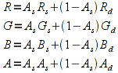
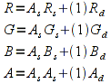
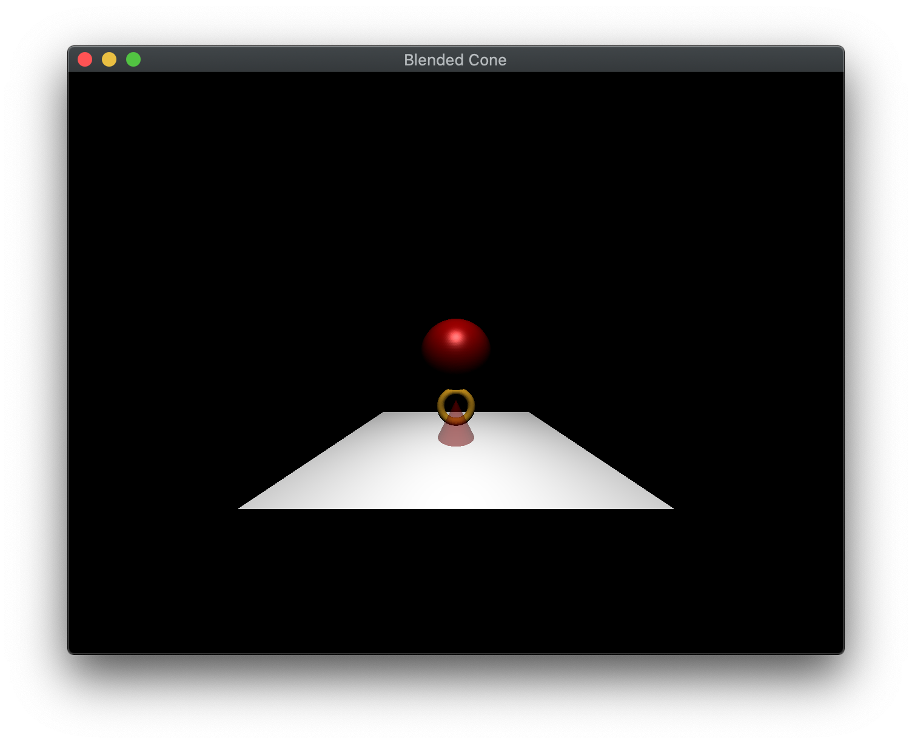

Up to this point, we have only been using the first three components when applying colors - the R, G, and B channels. However, all colors in OpenGL are treated as 32-bit values with the last byte representing the *alpha* (or A) channel. This channel represents the *opacity* (or equivalently *transparency*) of the color. So far all of our alpha channels have been set to 1, meaning that all our objects are *opaque*, i.e. solid. An alpha channel of 0 would represent a completely transparent object (such as glass). By using values between 0 and 1, we get translucent objects where the final color of the pixel is a *blend* of the object color with the current framebuffer pixel where the blending calculation is determined by various parameters set in the application.

## Getting Started

Navigate into the **CS370\labs** directory on your **H:** drive.

Download [CS370\_Lab11.zip](src/CS370_Lab11.zip), saving it into the **labs** directory.

Double-click on **CS370\_Lab11.zip** and extract the contents of the archive into a subdirectory called **CS370\_Lab11**

Open CLion, select **Open or Import** from the main screen (you may need to close any open projects), and navigate to the **CS370\_Lab11** directory. This should open the project and execute the [CMake](https://cmake.org) script to configure the toolchain.

## Alpha Channel

One common place to set the alpha channel is when creating a material. Thus we can make a translucent object by simply adjusting the alpha channel for the three color properties, i.e. the ambient, diffuse, and specular.

### Tasks

- Add code to **build\_materials()** to create a *redAcrylic* translucent material with alpha values 0.5f. **Hint:** Simply copy the *redPlastic* material as a starting point.

- Add code to **build\_materials()** to add the *redAcrylic* material into the *Materials* vector using the **push\_back()** method

Try experimenting with different alpha values to see what effect it has on the translucency of the object.

## Alpha Blending

In order to use *alpha blending* we simply enable it (usually in the initializations) using:

```cpp
glEnable(GL_BLEND);
```

Once blending is enabled, we must then specify *how* we wish OpenGL to combine the colors by setting a *blending function* for both the *source* (the pixel from the object being rendered) and the *destination* (the current pixel in the framebuffer). The blending function is a linear function with the proportion for each part set using:

```cpp
glBlendFunc(src_val, dest_val);
```

where *src\_val*, and *dest\_val* are the factors used in the blending function. Two common *src\_val*/*dest\_val* pairs are (**GL\_SRC\_ALPHA**, **GL\_ONE\_MINUS\_SRC\_ALPHA**) and (**GL\_SRC\_ALPHA**, **GL\_ONE**).

**GL\_SRC\_ALPHA/GL\_ONE\_MINUS\_SRC\_ALPHA**

For source and destination colors given by (Rs,Gs,Bs,As) and (Rd,Gd,Bd,Ad), these blending factors combine the colors as follows

> 

These factors guarantee that the color channels *remain bounded* within the range [0.0,1.0] and hence will appear more or less correct. However, the problem is that to use these factors properly, *rendering order is important*. In particular, objects *must* be rendered from *back-to-front* (i.e. using a painter's algorithm) to produce the proper final color. This is typically not difficult for static scenes, but for ones where the object positions are changing either relative to each other or relative to the camera, maintaing proper rendering order can be tricky.

**GL\_SRC\_ALPHA/GL\_ONE**

For source and destination colors given by (Rs,Gs,Bs,As) and (Rd,Gd,Bd,Ad), these blending factors combine the colors as follows

> 

These factors guarantee that the same color is rendered *regardless of order* and hence is much better for dynamic scenes. However, since the final color is simply the total sum of all the object colors, the final color may saturate in one or several of the color channels, i.e. be greater than one and hence be clipped to 1.0 when rendered. Thus the final color may not be the expected color (or may simply be white if all the color channels saturate).

### Tasks

- Add code to **main()** to enable alpha blending using **GL\_BLEND**

- Add code to **main()** to set the blend factors to **GL\_SRC\_ALPHA** and **GL\_ONE\_MINUS\_SRC\_ALPHA**

- Add code to **phong.frag** to change the last component of *fragColor* from 1.0f to the material's ambient alpha value. **Note:** Without doing this blending will not occur because the fragment will always be opaque.

## Depth Test with Alpha Blending

Normally we simply enable the depth test in order to perform hidden surface removal such that the closest object is the one that appears in the final scene, which is correct if a translucent object is *behind* an opaque object. However since alpha blending occurs in the *fragment processor* if the depth test is enabled when multiple translucent objects are rendered that are *in front* of an opaque object, some may be clipped before reaching the fragment processor unless a back to front rendering order can be guaranteed. Hence whenever a translucent object is rendered, we will temporarily disable **updating** of the depth buffer (note: this does not disable the depth test) using:

```cpp
glDepthMask(GL_FALSE);
```

After rendering all the translucent objects, updating the depth buffer should be re-enabled to allow proper rendering of subsequent objects. This is simply done using

```cpp
glDepthMask(GL_TRUE);
```

Hence the typical process will be to render all **opaque** objects first, then disable updating the depth buffer while rendering all **translucent** objects, and finally reenable updating of the depth buffer.

### Tasks

- Add code to **render\_scene()** to disable depth buffer updating when rendering the translucent cone. **Note:** Be sure to re-enable depth buffer updating after rendering the cone.

## Compiling and running the program

You should be able to build and run the program by clicking the small green arrow towards the right of the top toolbar.

At this point you should see a bouncing sphere and torus rolling around a translucent cone.

> 

To quit the program simply close the window.

Congratulations, you have now written an application with translucency.

Next we will briefly touch on how to make simple meshes in Blender.
