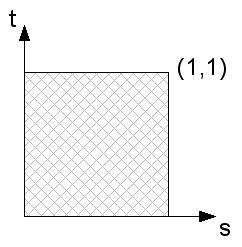
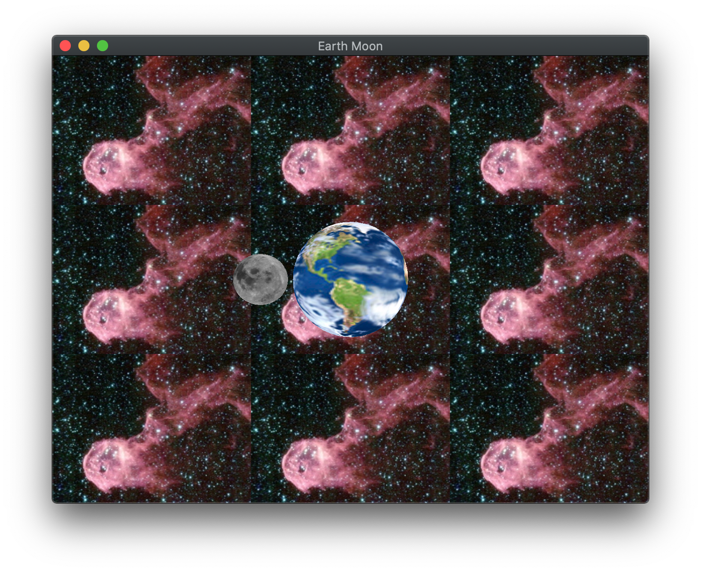

The geometry to render most natural objects is usually quite complicated, e.g. every blade of grass within a field or the surface variations of the bricks in a wall. Therefore, most graphics systems provide an incredibly powerful way of *simulating* complex geometry by painting a *texture* onto a geometrically simple surface, e.g. an image of grass on a flat rectangle. This technique is called *texture mapping* (think of wallpapering a surface). Since OpenGL does not provide a way to load images from files, we will be using the **stb\_image.h** library to provide routines to load our images. Once we have loaded the image data from the file, we will create corresponding textures from these images (in this lab an earth and moon) which will then be passed as *sampler* shader variables. OpenGL has capabilities to handle 1D, 2D, and even 3D textures, however we will only be concerned with 2D textures (images) in this course.

The image is represented as a texture map which has normalized extents (0,0) in the lower left corner and (1,1) in the upper right corner of the image (scaled to the square regardless of the original aspect ratio). Each element of the texture map is known as a *texel*. To apply a texture to a surface, we simply need to associate with each vertex a corresponding texel and allow the graphics system to perform any necessary distortions to place the texture (or part of the texture) onto the rendered surface. Fortunately, the **.obj** files generated from Blender will include texture coordinates for the models we will be using. 

## Getting Started

Navigate into the **CS370\labs** directory on your **H:** drive.

Download [CS370\_Lab13.zip](src/CS370_Lab13.zip), saving it into the **labs** directory.

Double-click on **CS370\_Lab13.zip** and extract the contents of the archive into a subdirectory called **CS370\_Lab13**

Open CLion, select **Open or Import** from the main screen (you may need to close any open projects), and navigate to the **CS370\_Lab13** directory. This should open the project and execute the [CMake](https://cmake.org) script to configure the toolchain.

## Loading Images

In order to create a texture from an image, we will import images into memory using the **stb\_image.h** library which will allow loading of a variety of file formats (including **.jpg**, **.png**, **.bmp** and others) via the command

```cpp
unsigned char *data = stbi_load(char *filename, int &x, int &y, int &n, int chan);
```

where *filename* is a string containing the name of the image file, *x* is the returned width of the image, *y* is the returned height of the image, *n* is the returned number of color channels per pixel, and *chan* is the number of desired color channels per pixel (or 0 for the native number of channels in the image).

While the library provides a simple way to import images, it works best if the image dimensions are powers of 2.

**Note:** Take a look at the beginning of the **build\_textures()** function to see the usage of the loader.

## Creating Texture Maps

All textures, regardless of resolution, are mapped to a grid of *texture coordinates* (*texels*) known as the *s-t* plane with the *s*-axis representing the horizontal direction and the *t*-axis representing the vertical direction as shown below:

> 

The texture coordinates thus are in the range [0,1] for both axes. They are then applied to the objects in the fragment processor through a mapping of vertices to texture coordinates.

Just like with the other buffers we have seen, e.g. vertex positions, colors, normals, etc., we will need to create references to our texture buffers using

```cpp
void glGenTextures(GLsizei n, GLuint *textures);
```

where *n* is the number of textures we wish to create and *textures* will be the array where the generated texture id's will be stored.

OpenGL supports applying multiple textures to a single object (which we will cover in a later lab) through multiple *texture units*. Thus we need to specify which texture unit will be active using

```cpp
void glActiveTexture(GLenum texture);
```

where *texture* is a symbolic constant of the form **GL\_TEXTURE***i* where *i* is the number of the texture unit we wish to make active, e.g. **GL\_TEXTURE0**.

### Loading Image Data into a Texture

Once we have loaded the image data, created the texture id's, and selected the active texture unit, need to bind the texture that we wish to use into the texture unit using

```cpp
void glBindTexture(GLenum target, GLuint texture);
```

where *target* is a symbolic constant denoting the *type* of texture we are binding (e.g. for image data **GL\_TEXTURE\_2D**) and *texture* is the texture id for the texture we are binding.

We are now ready to load the image data into the currently bound texture using

```cpp
void glTexImage2D(GLenum target, GLint level, GLint internalFormat, GLsizei width, GLsizei height, GLint border, GLenum format, Glenum type, const void *data);
```

where *target* is again the type of texture we are using (typically **GL\_TEXTURE\_2D**), *level* is the mipmap level we are loading the data into (to be discussed later), *internalFormat* specifies the format OpenGL should represent the texture with, *width* is the width of the image we are loading into the texture, *height* is the height of the image we are loading into the texture, *border* specifies if there is a padding around the image (useful for wrapping discussed later), *format* is the format of the image data, *type* is data type of the color channels in the image, and *data* is the image data.

### Texture Scaling and Mipmaps

Since textures are applied in the fragment processor, they are placed on the *rendered* surfaces of objects. Many times the rendered resolution will not match the resolution of the texture map, so OpenGL needs to know how to account for this difference. Two cases can occur - either the rendered surface is higher resolution (requiring the texture to be *magnified*) or lower resolution (requiring the texture to be *minified*) - and corresponding modes must be set for both cases. In the case of maginification, the system must upscale the image using either the *nearest* corresponding texel or *linear* extrapolation from surrounding texels. Often times if scaling is severe, the texture will appear pixelated in which case an additional higher resolution texture should be created by the programmer and loaded into the application. Small magnifications, however, can be handled by setting

```cpp
void glTexParameteri(GLenum target, GLenum pname, Type param);
```

where *target* is again the type of texture we are using (typically **GL\_TEXTURE\_2D**), *pname* is the parameter we wish to set (e.g. **GL\_TEXTURE\_MAG\_FILTER** for magnification), and *param* is the value we wish to set the parameter to (e.g. **GL\_NEAREST** or **GL\_LINEAR**).

Minification, when the texture is larger than the rendered surface, typically occurs more frequently, e.g. high-res textures for small (in pixels) objects. One possibility is to simply use a reduction filter similar to magnification (**GL\_TEXTURE\_MIN\_FILTER** with **GL\_NEAREST** or **GL\_LINEAR**) to produce reduced resolution images, however repeatedly performing this resizing for numerous objects is inefficient. OpenGL provides an alternative mechanism known as *mipmapping* which precomputes reduced resolution textures (also storing them on the graphics card) and then applies the one that most closely matches the rendered object's resolution. We can have the system generate mipmap levels automatically using

```cpp
void glGenerateMipmap(GLenum target);
```

where *target* is again the type of texture we are using (typically **GL\_TEXTURE\2D**).

Mipmaps work best when the original image dimensions are powers of 2 (but they are not required to be). The mipmaps create reduced resolution textures by repeatedly dividing each dimension in half either a prespecified number of times or until one of the dimensions becomes 1.

Occasionally, auto generating mipmaps can produce undesirable images (particularly for ones with fine detail), thus we can load alternative images into specific mipmap levels for the same texture using the *level* parameter with **glTexImage2D()** - which is particularly useful for better controlling the appearance at very small resolutions. 

The minification and mipmap mode are then set via the **glTexParameteri()** command for the **GL\_TEXTURE\_MIN\_FILTER** parameter to either *nearest* or *linear* for *both* the texel and mipmap level using either **GL\_NEAREST\_MIPMAP\_NEAREST**, **GL\_LINEAR\_MIPMAP\_NEAREST**, **GL\_NEAREST\_MIPMAP\_LINEAR**, or **GL\_LINEAR\_MIPMAP\_LINEAR**.

**BE CAREFUL**: mipmaps can use a substantial amount of graphics memory and produce significant artifacting, so it is best to try to load textures that are roughly the necessary size for the objects being rendered, i.e. avoid loading high resolution textures for low resolution objects.

### Texture Wrapping

Lastly, we need to specify how textures will wrap, i.e. repeat, when applied to objects whose *geometry* is larger than the texture map extents. Two alternatives are to *repeat* the entire texture map (i.e. *tile* the surface) or to simply *clamp* (i.e. *extend*) the coloring of the edge. Each of these options can be set separately for the *s* and *t* directions (refer to the texture plane discussion above) via the **glTexParameteri()** command for the **GL\_TEXTURE\_WRAP\_S** and **GL\_TEXTURE\_WRAP\_T** parameters to either **GL\_REPEAT** or **GL\_CLAMP**.

### Tasks

- Add code to **build\_textures()** to bind the current texture id from the *TextureIDs[]* array (using the loop counter). **Hint:** This is a **GL\_TEXTURE\_2D** texture.

- Add code to **build\_textures()** to load the image data into the current texture using mipmap level 0, the **GL\_RGBA** internal format, the width and height from the image library load command, 0 for the border, **GL\_RGBA** as the format of the image data (note there were 4 color channels specified as the format when the image was loaded), **GL\_UNSIGNED\_BYTE** as the color channel datatype, and the *image\_data* variable containing the data from the stb library load command. **Hint:** This is a **GL\_TEXTURE\_2D** texture.

- Add code to **build\_textures()** to autogenerate mipmaps. **Hint:** This is a **GL\_TEXTURE\_2D** texture.

- Add code to **build\_textures()** to set the scaling modes such that the magnification filter is set to linear and the minification filter to linear for texels and mipmap levels. **Hint:** This is a **GL\_TEXTURE\_2D** texture.

- Add code to **build\_textures()** to set the wrapping modes to repeat in both the *s* and *t* directions. **Hint:** This is a **GL\_TEXTURE\_2D** texture.

## Using Texture Maps

Textures are associated with an object on a *per vertex* basis (similar to normals for lighting) by assigning a *texture coordinate* to each vertex (often known as a *uv*-coordinate). This assignment will relate which parts of the texture map is connected to which vertices in the object. Texture coordinates outside the range [0,1] are mapped to points on the *extended* texture map determined by the wrapping properties discussed in the previous section. Once each vertex in the object is assigned a corresponding texture coordinate, OpenGL will copy the appropriate portion of the texture map (or mipmap) onto the rendered surface, interpolating or extrapolating as needed based on the scaling properties discussed in the previous section. The assignment of texture coordinates is done (similar to setting the normal) through an attribute buffer. 

**Note:** The model loader we are using will return a vector of *uv*-coordinates for each vertex.

Prior to rendering the object, we must *bind* the texture coordinate buffer along with the texture we wish to use (which will associate it with a shader *sampler* variable discussed below) again using

```cpp
void glBindTexture(GLenum target, GLuint texture);
```

where *target* is a symbolic constant denoting the *type* of texture we are binding (e.g. for image data **GL\_TEXTURE\_2D**) and *texture* is the texture id for the texture we are binding.

### Tasks

- Add code to **render\_scene()** to bind the *Earth* texture id from the *TextureIDs[]* array for the Earth object. **Hint:** This is a **GL\_TEXTURE\_2D** texture.

- Add code to **render\_scene()** to bind the *Moon* texture id from the *TextureIDs[]* array for the moon object. **Hint:** This is a **GL\_TEXTURE\_2D** texture.

## Texture Maps in Shaders

The currently bound texture maps are associated with a shader variable known as a *sampler* of type **uniform sampler2D** for our image data. This sampler variable will retrieve, i.e. *sample*, the image at the specified texel and apply any scaling and wrapping modes to generate the pixel color. This is done using the shader function 

```cpp
vec4 texture(sampler2D texture, vec2 texCoord);
```

where *texture* is the sampler variable and *texCoord* is the texture coordinate (passed from the vertex shader).

### Tasks

- Add code to **basicTex.vert** to pass the texture coordinates received in the *vTexCoord* variable to the fragment shader by assigning it to the *texCoord* variable

- Add code to **basicTex.frag** to sample the *tex* sampler variable at the *texCoord* location and assign the sampled color to *fragColor* using

    ```cpp
    fragColor = texture(tex, texCoord);
    ```

At this point you should see a texture mapped moon orbiting a texture mapped rotating earth.

## Backgrounds

One way to add a background image to our scenes is to use a simple quad that is the same size as the window. This can be accomplished by adjusting the projection matrix extents and camera position back to their default values and then rendering a square with corners (-1,-1) and (1,1). Since we will want the background to be *behind* any rendered geometry, typically we will render the background image *first* without updating the depth buffer (similar to translucent objects).

### Tasks

- Add code to **build\_geometry()** to set texture coordinates for the vertices used to draw the square such that the upper right corner of the square has texture coordinate (2,2) and the lower left corner of the square has texture coordinate (-1,-1). **Note:** The square is using extended texture plane coordinates and the wrapping mode for the texture. **Hint:** Use the **push\_back()** method for the *uvCoords* vector to add **vec2** texture coordinate vectors.

- Add code to **draw\_background()** to set an orthographic projection matrix with extents (-1, 1, -1, 1, -1, 1)

- Add code to **draw\_background()** to set the camera matrix to the identity

- Add code to **draw\_background()** to set the model matrix to the identity

- Add code to **draw\_background()** to bind the *Space* texture id from the *TextureIDs[]* array for the background. **Hint:** This is a **GL\_TEXTURE\_2D** texture.

- Add code to **draw\_background()** to disable/reenable writing to the depth buffer. **Hint:** Use the **glDepthMask()** function.

## Compiling and running the program

You should be able to build and run the program by clicking the small green arrow towards the right of the top toolbar.

At this point you should see a textured moon orbiting a textured earth (**note:** they are *not* astronomically correct) with a tiled space background.

> 

To quit the program simply close the window.

Congratulations, you have now written an application with texture mapping.

Next we will investigate how to create scenes using a scene graph data structure.
