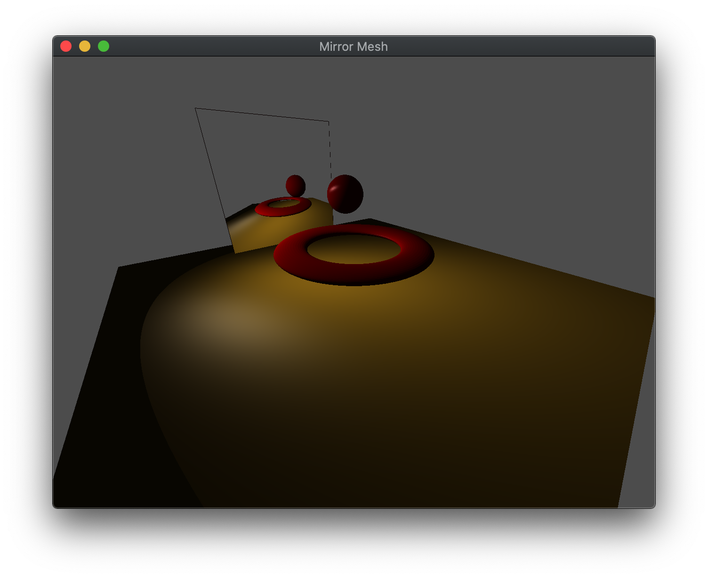

Often times we wish to have *reflective* surfaces, i.e. mirrors, within a scene. Unfortunately, similar to shadow mapping, one of the major shortcomings of the graphics pipeline is the lack of global information which would be needed for reflections (the reflective surface would need to know about the other objects in the scene). Again, we can address this issue (with a performance impact) using *multipass rendering*. To create a mirror, we will generate a texture map (known as an *environment map*) of the scene *rendered from the point of view of the reflective object*, which is then placed on the object within the scene thereby giving the appearance of reflection.

## Getting Started

Navigate into the **CS370\labs** directory on your **H:** drive.

Download [CS370\_Lab16.zip](src/CS370_Lab16.zip), saving it into the **labs** directory.

Double-click on **CS370\_Lab16.zip** and extract the contents of the archive into a subdirectory called **CS370\_Lab16**

Open CLion, select **Open or Import** from the main screen (you may need to close any open projects), and navigate to the **CS370\_Lab16** directory. This should open the project and execute the [CMake](https://cmake.org) script to configure the toolchain.

## Pass 1 - Texture Mapping the Framebuffer

### Environment map texture

In order to store the image of the scene from the perspective of the mirror, we will create a texture (similar to the shadow map) which is the same size as the framebuffer to avoid the need to perform any scaling. Furthermore, typically we will not enable mipmapping for the environment map and simply copy the framebuffer into level 0 of the environment map texture (of equivalent size). 

### Tasks

- Add code to **build\_mirror()** to generate a texture for the environment map (bound using the *MirrorTex* id) that is *ww* by *hh* using **glTexImage2D()**

```cpp
    glTexImage2D(GL_TEXTURE_2D, 0, GL_RGBA, ww, hh, 0, GL_RGBA, GL_FLOAT, NULL);
```

**Note:** When creating this texture, we did not build mipmaps as we will be loading the texture map dynamically each time we render the scene (thus it would be computationally expensive to continually regenerate mipmaps).

### Setting the mirror perspective

We will create the effect of reflection by rendering the scene from the *point of view of the reflective object* and copy that image into the environment map. Therefore, the first thing we must do in the **create\_mirror( )** function is set an appropriate projection matrix using either **ortho( )** or **frustum( )**. The key here is to select extents that are representative of the reflective surface, i.e. usually with the near clipping plane at (or very near for a frustum) 0.0 which will be the object's surface, the far clipping plane set to capture the objects of interest, and the other extents to match the geometry of the object itself. Next we need to position the camera at the *center of the object* and point it *away from* the reflective surface *towards the viewer*. Depending on the desired effect, this direction can be either perpendicular to the surface or (more realistically) at an equal angle from the viewer (recall angle of incidence equals angle of reflection). Once the projection matrix and camera position are set appropriately, we simply render the scene *without* the reflective surface. This will create the "picture" of the scene from the point of view of the reflective surface in the framebuffer. However instead of using **glfwSwapBuffers( )** to display it on the screen, we will place the image *into a texture* using

```cpp
glCopyTexImage2D(GL_TEXTURE_2D, level, format, x, y, w, h, border);
```

where *level* indicates the mipmap level to store the image into (which we will use level 0 for the environment map), *format* is the format to store the image in (usually **GL\_RGBA**), *x* and *y* are the initial lower-left *raster coordinates* of the framebuffer, *w* and *h* are the width and height of the image to capture, and *border* specifies a border width for the image.

**Note:** **glCopyTexImage2D( )** copies the framebuffer into the *currently selected* texture map, so be careful to avoid overwritting a pre-existing object texture.

Also since the environment takes the image from the framebuffer, any effects used in rendering the scene, e.g. lighting and texture mapping, will appear in the reflection.
### Tasks

- Add code to **create\_mirror()** to set the *proj\_matrix* to a **frustum** with extents (-0.2,0.2,-0.2,0.2,0.2,100.0)

- Add code to **create\_mirror()** to position the mirror camera using **lookat** using *mirror_eye*, *mirror_center*, *mirror_up* as the vectors. **Note:** we will use *mirror_eye* as the translation transformation when we render the mirror

- Add code to **create\_mirror()** to activate **GL_TEXTURE0** using **glActiveTexture()**

- Add code to **create\_mirror()** to bind *MirrorTex* which will be the texture where the environment map is stored

- Add code to **create\_mirror()** to copy the framebuffer to the bound environment map using **glCopyTexImage2D()** into level 0, using **GL_RGBA** format, starting at (0,0), of size (ww,hh), and with 0 border

- Add code to **main()** in the rendering loop to call **create\_mirror()** before rendering the actual scene

**Note:** To help with mirror positioning and extents, uncomment the **renderQuad()** function and comment out **display()** to render the environment map to the screen until it appears the way you would like.

## Rendering the Scene with Mirror

Once the  map is created, we simply render the scene as usual (using **render\_scene()**) and add the mirror as a texture mapped object with the environment map.

### Tasks

- Add code to **render\_mirror()** to make **GL_TEXTURE0** active (using **glActiveTexture()**)

- Add code to **render\_mirror()** to *bind* the *MirrorTex*

- Add code to **render\_mirror()** to compute *trans* as a translation by *mirror\_eye*, i.e. place the mirror at the same spot that the mirror camera was located to generate the environment map

- Add code to **render\_mirror()** to draw the mirror using **draw_tex_object()** with the *Mirror* object

**Note:** No new shader code was required as it simply is rendering the scene normally from two different perspectives.

## Compiling and running the program

You should be able to build and run the program by clicking the small green arrow towards the right of the top toolbar.

At this point you should see a torus and revolving sphere that are reflected in a mirror

> 

To quit the program simply close the window.

Congratulations, you have now written an application incorporating mirrors.

Next we will investigate how to apply multiple textures to an object.
