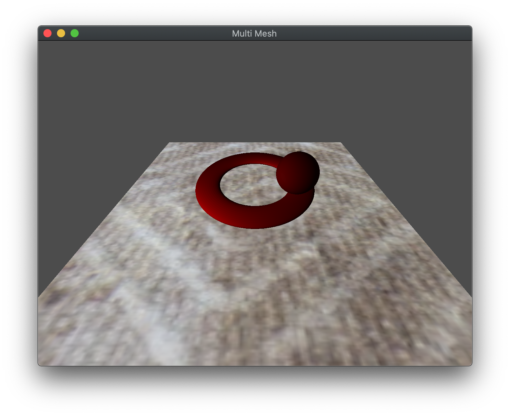

While texture mapping is a nice way of simulating surface textures without additional geometry, we can further embellish the appearance by blending *multiple textures* together on the same surface using *multi-texturing*. In this lab we will see how to use multiple texture *units* to sample multiple textures in the fragment shader. 

## Getting Started

Navigate into the **CS370\labs** directory on your **H:** drive.

Download [CS370\_Lab17.zip](src/CS370_Lab17.zip), saving it into the **labs** directory.

Double-click on **CS370\_Lab17.zip** and extract the contents of the archive into a subdirectory called **CS370\_Lab17**

Open CLion, select **Open or Import** from the main screen (you may need to close any open projects), and navigate to the **CS370\_Lab17** directory. This should open the project and execute the [CMake](https://cmake.org) script to configure the toolchain.

## Texture Map references

Since we are using several textures, we will need to have several sampler shader variables. We do by declaring multiple **uniform sampler2D** variables in the *fragment shader*. Then we will associate these sampler variables with a application reference identifiers using

```cpp
GLint glGetUniformLocation(GLuint program, const GLchar *name);
```

where *program* is the shader program and *\*name* is a string with the name of the shader sampler variable.

### Tasks

- Add code to **main()** to store references into *tex_base_loc* and *tex_dirt_loc* from the *baseMap* and *dirtMap* shader variables in *tex_program*

**Note:** *baseMap* and *dirtMap* are the sampler variables defined in **multiTex.frag**.

### Multiple Texture Units

In order to use multiple textures, we will need to utilize multiple *texture units* by defining which texture unit to associate with which shader sampler, and then *bind* the textures we wish to use to each unit. OpenGL supports a minimum of 16 texture units per pipeline stage which are referred to using the constants **GL_TEXTURE\#** where \# is the number of the texture unit, e.g. **GL_TEXTURE0**. Thus we will specify which texture unit to associate with a shader sampler using

```cpp
void glUniform1i(GLint location, GLint value);
```

where *location* is the reference for the shader sampler and *value* is the unit number we wish to associate with the sampler. Then we will make the texture unit *active* using 

```cpp
void glActiveTexture(GLenum texture);
```

where *texture* is a symbolic constant of the form **GL\_TEXTURE***i* where *i* is the number of the texture unit we wish to make active, e.g. **GL\_TEXTURE0**.

Finally, we will bind the desired texture to the unit as usual using

```cpp
void glBindTexture(GLenum target, GLuint texture);
```

where *target* is a symbolic constant denoting the *type* of texture we are binding (e.g. for image data **GL\_TEXTURE\_2D**) and *texture* is the texture id for the texture we are binding to the currently active texture unit.

### Tasks

- Add code to **render\_scene()** to set the *tex_base_loc* to 0, i.e. we will bind the base texture to texture unit 0

- Add code to **render\_scene()** to make texture unit 0 active using **GL_TEXTURE0**

- Add code to **render\_scene()** to bind the *Carpet* texture id to texture unit 0

- Add code to **render\_scene()** to set the *tex_dirt_loc* to 1, i.e. we will bind the dirt texture to texture unit 1

- Add code to **render\_scene()** to make texture unit 1 active using **GL_TEXTURE0**

- Add code to **render\_scene()** to bind the *Dirt* texture id to texture unit 1 if the *dirty* flag is true or the *Blank* texture id otherwise

**Note:** Since our shader will be combining colors from both textures, it is important that they each be associated with a texture unit containing an appropriate texture

## Multiple Texture Coordinates

For this lab we will simply be using the same texture coordinates for both texture maps. However, if the model/loader supported multiple texture coordinates, we could store them in separate texture coordinate buffers and pass them through the vertex shader to the fragment shader.

## Combining Texture Colors

The last step to applying multiple textures is sampling both textures in the fragment shader and deciding how to *combine* the two colors together for the final fragment color. 

Several options can include simple addition of the two colors, simple multiplication of the two colors, using the **mix()** function to perform a linear interpolation (possibly based on an application variable), or some other combination of the two.

### Tasks

- Add code to **render\_scene()** to set the *tex_mix_loc* to *mix*. **Note:** Use **glUniform1f()**.

- Add code to **multiTex.frag** to sample *dirtMap* at *texCoord* and store the result in *dirtColor*

```cpp
    vec4 dirtColor = texture(dirtMap, texCoord);
```

- Add code to **multiTex.frag** to mix the two texture colors using **mix()** with the *mixFactor*

```cpp
    fragColor = mix(baseColor,dirtColor,mixFactor);
```

**Note:** Try other ways of combining the two texture colors to see what effect it produces.

## Compiling and running the program

You should be able to build and run the program by clicking the small green arrow towards the right of the top toolbar.

At this point you should see a torus and revolving sphere over a carpet that is mixed with either a blank or "dirt" texture (toggled using spacebar). Arrow up/down will control the amount of the second texture that is mixed.

> 

To quit the program simply close the window.

Congratulations, you have now written an application incorporating multiple textures.

Next we will investigate how to apply multiple textures to accomplish bump mapping.
