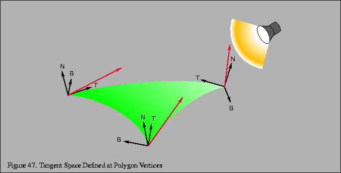
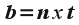
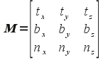
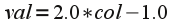
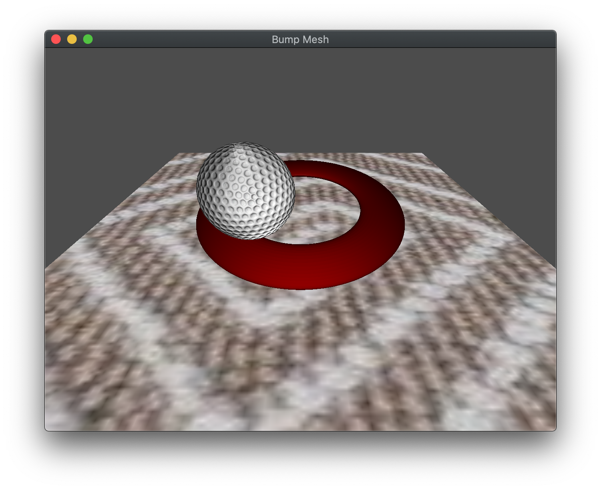

While multi-texturing is a nice way to further enhance the appearance of surfaces in our scene without adding additional geometry, unfortunately, the surfaces still *appear* flat, particularly with respect to lighting. One technique (that is based on multi-texturing) to create an even more realistic appearance of a rough surface is to adjust the *normals* to produce a *self-shadowing* effect known as *bump mapping*. Since normals are applied *per vertex* and then *interpolated* across the surface (per fragment) in the pipeline, this would require using extremely complex geometries to capture sufficient surface detail. However we can simulate this effect through *self-shadowing* which gives the appearance of a slightly varying, i.e. rough, surface based on a *normal map* which is stored in a texture. This normal map (which being a texture is applied on a *per pixel* basis) can then be used in the fragment shader to define the varying normals *per pixel* in order to produce a changing lighting effect across each fragment, i.e. bump mapping. This will be done *in addition* to the application of a surface texture using the multi-texturing procedure from the last lab. Then we can perform the Phong shading calculations for lighting using this varying normal. However, unlike the Phong calculations performed in [Lab 10](lab10.html) where all the vectors were defined in *world space*, we will instead transform everything into *tangent space*, i.e. such that the normal becomes the *z*-axis. This is done by computing two additional *tangent* vectors that become the corresponding *x* and *y* axes.

## Getting Started

Navigate into the **CS370\labs** directory on your **H:** drive.

Download [CS370\_Lab18.zip](src/CS370_Lab18.zip), saving it into the **labs** directory.

Double-click on **CS370\_Lab18.zip** and extract the contents of the archive into a subdirectory called **CS370\_Lab18**

Open CLion, select **Open or Import** from the main screen (you may need to close any open projects), and navigate to the **CS370\_Lab18** directory. This should open the project and execute the [CMake](https://cmake.org) script to configure the toolchain.

## Tangent Space

In order to apply bump mapping, we need to tranform the various lighting vectors into *tangent space*, i.e. the plane that is *tangent* to the surface with the vertex becoming the origin of the new coordinate system. This transformation makes the surface normal at the vertex the new *z*-axis (which simplifies the application of the bump map texture). Two additional perpendicular vectors, known as the *tangent* and *bitangent*, will then define the tangent plane (i.e. become the *x* and *y* axes) - see the following [LearnOpenGL - Normal Mapping](https://learnopengl.com/Advanced-Lighting/Normal-Mapping)

Thus we will compute a transformation of basis to map world coordinates to tangent space coordinates as illustrated below

> 

To perform this transformation, we need the three new basis vectors, *N*, *T*, and *B*. Fortunately, we already have the normal (from the model). Since we are using *triangles* for our primatives, the *tangent* vector is simply defined as a vector between two of the vertices (which must lie *in* the plane of the primative). Then we can simply compute the vector *cross product* to give the *bitangent* as:

> 

The transformation matrix for the lighting vectors (assuming **N**, **T**, and **B** are unit vectors) is then given by

> 

We can then multiply this matrix by the corresponding light vectors (which transforms them to tangent space) via three *dot products* with **T**, **B**, and **N** for the transformed *x*, *y* and *z* accordingly. 

To simplify the process of computing the tangent and bitangent for each vertex in our models, we will be using the **tangentspace** library function

```cpp
void computeTangentBasis(vector<vec4> &vertices, vector<vec2> &uvs, vector<vec3> &normals, vector<vec3> &tangents, vector<vec3> &bitangents);
```

where the *vertices*, *uvs*, and *normal* vectors will be the data loaded from the object models, and *tangents* and *bitangents* will be returned by the function.

### Tasks

- Add code to **load_object()** to compute the tangents and bitangents *after loading the model* using the **computeTangentBasis()** function

**Note:** We have corresponding attribute buffers for the tangent and bitangent vectors that will correspond to additional shader variables in the vertex shader.

- Add code to **bumpTex.frag** to transform the view vector to tangent space using the dot product with the basis vectors

```cpp
    vec3 TangView = normalize(vec3(dot(Tangent, NormView),dot(BiTangent, NormView),dot(Normal, NormView)));
```

- Add code to **bumpTex.frag** to transform the light vector (for each light type) to tangent space using the dot product with the basis vectors

```cpp
    vec3 LightDirection = vec3(dot(Tangent, LightDir),dot(BiTangent, LightDir), dot(Normal, LightDir));
```

## Normal Map

Once we have the view and light vectors transformed to tangent space (which now has a normal given by (0,0,1)) for each fragment of the surface, we can obtain a perturbed tangent space normal *per pixel* and *compute* a modified lighting effect to produce self-shadowing. To accomplish this effect, we will store the perturbed surface normals into a *normal map* which is essentially an "image" of the surface where the geometric variations are stored as *colors* (again utilizing the correspondence in the pipeline between 3D coordinates and RGB colors). This map is loaded into a texture and applied in addition to the surface texture using multi-texturing in the fragment shader. Since we are only slightly perturbing the *direction* of the normal, i.e. we primarily maintain the *z*-axis which is the *blue* channel, normal maps appear as a mainly blue image. Because we are unable to store negative values in color channels, we instead scale the values such that those between [0,0.5] represent negative values and those between [0.5,1] represent positive values. We can then obtain the original component values via the simple formula

> 

We then compute the Phong model diffuse and specular terms with this perturbed normal and the transformed lighting vectors.

### Tasks

- Add code to **bumpTex.frag** to compute the perturbed normal from the normal map color

```cpp
    vec3 BumpNorm = normalize(2.0f*BumpCol.rgb - 1.0f);
```

**Note:** For this lab we are not including a material, so we assume the base material is simply white. However, it we could pass materials to the shader and combine a base material with the bump mapping lighting and base texture for added effect.

## Combining Texture Colors

The last step to applying bump mapping is to *combine* the color from the bump map lighting color with the base texture color for the final fragment color. 

Typically, since the lighting is an attenuation of the color channels, we will *multiply* the lighting effect with the base texture.

### Tasks

- Add code to **bumpTex.frag** to multiply the lighting effect with the sampled base texture color

```cpp
    fragColor = vec4(rgb,1.0)*texture(baseMap, texCoord);
```

**Note:** If the base texture utilizes the alpha channel (or we include a translucent material), we could also incorporate alpha blending into this effect.

## Compiling and running the program

You should be able to build and run the program by clicking the small green arrow towards the right of the top toolbar.

At this point you should see a torus and revolving "golf ball" sphere over a carpet. The spacebar will toggle multi texturing for the carpet, B will toggle bump mapping or simple multi texturing for the golf ball, and G will cycle between different normal maps for the golf ball.

> 

To quit the program simply close the window.

Congratulations, you have now written an application incorporating bump mapping.
